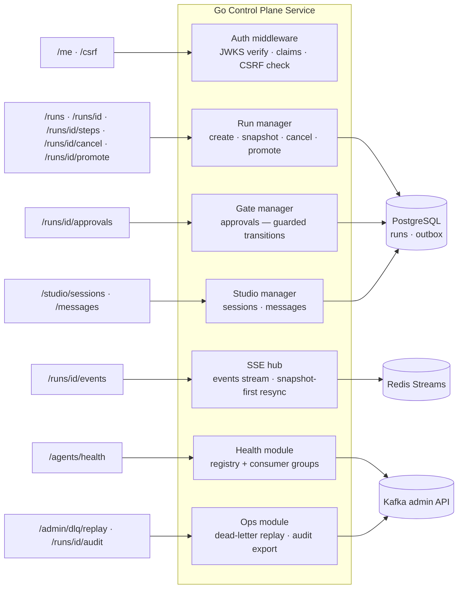
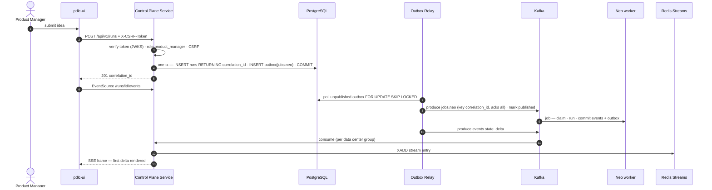
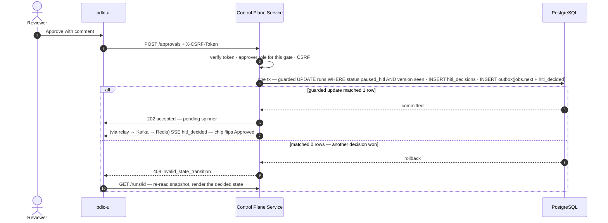

# iPDLC — API Specification (Go Control Plane Service)

Companion to `ipdlc-architecture.md` (system design), `ipdlc-kafka-flow.md` (messaging), `ipdlc-redis-streams-flow.md` (realtime), and `ipdlc-ui-architecture.md` (client). This document defines every endpoint the platform exposes, the contracts they honor, and the sequences behind the state-changing ones.

---

## 1. Conventions

**Base path** `/api/v1` — relative paths only from the client; the Global Server Load Balancer selects the data center.

**Authentication** — COIN session cookie on every request, attached by the browser. The service verifies the JSON Web Token locally (cached JWKS) and authorizes per request. There is no token in headers and no anonymous endpoint except the login redirect target.

**CSRF** — every state-changing request (POST) carries `X-CSRF-Token`, obtained once from `GET /api/v1/csrf`. GET requests and the Server-Sent Events stream carry none. Missing/invalid token → `403 csrf_invalid`.

**Idempotency** — POST endpoints that create work accept an optional `Idempotency-Key` header; replays within 24 h return the original response. (The pipeline's internal idempotency is the claim guard — this header protects against double-clicks and client retries.)

**Error model** — every non-2xx body:

```json
{ "error": { "code": "run_not_found", "message": "human-readable, no internals",
             "correlation_id": "b0bcc68a-...", "retryable": false } }
```

Codes are stable strings (`unauthorized`, `forbidden_role`, `csrf_invalid`, `run_not_found`, `invalid_state_transition`, `agent_unavailable`, `validation_failed`, `conflict_retry`). `403` responses are distinct from `404` — "no access" is never disguised as "does not exist" *within an entitlement the user can see*; runs outside the user's entitlement return `404` deliberately.

**Versioning** — path-versioned (`/api/v1`); response bodies carry `schema_version`. Breaking changes mint `/api/v2`; additive fields do not.

---

## 2. Endpoint catalog

| # | Method | Path | Purpose | Auth notes |
|---|---|---|---|---|
| 1 | GET | `/me` | Identity, roles, entitlements for the session | any authenticated |
| 2 | GET | `/csrf` | CSRF token for this session | any authenticated |
| 3 | POST | `/runs` | Create a run (pipeline or studio plan) | role `product_manager` |
| 4 | GET | `/runs` | List runs visible to the caller (paged, filtered) | entitlement-filtered |
| 5 | GET | `/runs/{corr_id}` | Run snapshot — the hydration seed | owner or entitled |
| 6 | GET | `/runs/{corr_id}/events` | Server-Sent Events stream | owner or entitled |
| 7 | GET | `/runs/{corr_id}/steps/{step}` | Full step detail (lazy content for the panel) | owner or entitled |
| 8 | POST | `/runs/{corr_id}/approvals` | Decide the pending human gate | role `approver` for the gate |
| 9 | POST | `/runs/{corr_id}/cancel` | Cancel a live run | owner or role `approver` |
| 10 | POST | `/studio/sessions` | Start a Studio session (one-step plan, conversational) | role `product_manager` |
| 11 | POST | `/studio/sessions/{corr_id}/messages` | Next user turn in a Studio session | session owner |
| 12 | POST | `/runs/{corr_id}/promote` | Promote a Studio result into a full pipeline run | session owner |
| 13 | GET | `/agents/health` | Liveness/health per agent (drives Studio gating) | any authenticated |
| 14 | GET | `/runs/{corr_id}/audit` | Decision trace export (events + gates + costs) | role `auditor` or owner |
| 15 | POST | `/admin/dlq/{topic}/replay` | Republish a dead-lettered message, attempt+1 | role `platform_ops` |

---

## 3. Endpoint definitions

### 3.1 `GET /me`
Response `200`:
```json
{ "schema_version": 1, "soeid": "np12345",
  "roles": ["product_manager", "approver"],
  "entitlements": ["consumer-lending"],
  "display_name": "N. P." }
```
`401` → client performs full-page redirect to COIN with a return URL.

### 3.2 `POST /runs`
```json
{ "product_name": "Native Mobile PIL Autopay",
  "idea": "Native mobile Autopay capability for PIL customers...",
  "run_mode": "pipeline",
  "plan": null,
  "attachments": ["upload-token-..."] }
```
`plan: null` selects the default full plan; an explicit plan (e.g. `["smith"]` with `parent_corr_id`) is how re-runs are expressed. Response `201`:
```json
{ "schema_version": 1, "correlation_id": "b0bcc68a-...", "status": "running", "plan": ["neo","architecture","smith","tank","morpheus"] }
```
Errors: `422 validation_failed` (empty idea), `403 forbidden_role`, `503 agent_unavailable` **only when the first plan step's agent is down** — fail before accepting work that cannot start.

### 3.3 `GET /runs/{corr_id}` — snapshot
Response `200` is the `RunSnapshot` contract from the User Interface document (status, plan, cursor, per-step roll-ups with `degraded_reasons`, `pending_gate`, `last_event_id`, `total_token_cost`). This endpoint is also the recovery path: the snapshot-first resync builds from the same query.

### 3.4 `GET /runs/{corr_id}/events` — Server-Sent Events
Request headers: `Accept: text/event-stream`, optional `Last-Event-ID` (sent automatically by `EventSource` on reconnect). Frames:
```
id: 1754745601123-0            ← the Redis stream entry identifier
event: state_delta | hitl_required | hitl_decided | pipeline_complete | run_failed | snapshot
data: { "correlation_id": "...", "agent": "neo", "payload": { ... } }
retry: 3000
```
Server behavior: authorize once at connect; resume from `Last-Event-ID`; on unknown identifier send one `snapshot` event then continue live; `: keepalive` comment every 15 s. Requires HTTP/2 on the route (browser connection caps on HTTP/1.1).

### 3.5 `POST /runs/{corr_id}/approvals`
```json
{ "gate": "neo_approval", "verdict": "approved", "comment": "Proceed — watch Reg E disclosures." }
```
`comment` required when `verdict` is `rejected` or `changes_requested`. Response `202` (accepted — the client renders pending until the `hitl_decided` delta arrives; approvals are never optimistic). Errors: `409 invalid_state_transition` (gate already decided or run not paused — the guarded update matched zero rows), `403 forbidden_role` (caller lacks the approver role *for this gate*), `422` (missing comment on rejection).

### 3.6 `POST /runs/{corr_id}/cancel`
Body `{ "reason": "..." }`. Guarded transition from `running` or `paused_hitl` to `cancelled`; `409` otherwise. In-flight agent work completes its current step and is discarded on the next dispatch check — cancellation is a state fact, not a signal to kill processes.

### 3.7 Studio: `POST /studio/sessions`, `POST /studio/sessions/{corr_id}/messages`, `POST /runs/{corr_id}/promote`
Session creation is `POST /runs` sugar: `run_mode: "studio"`, one-step plan for the chosen agent, plus a persistent Agent Development Kit session. Each message POST appends a user turn (outbox → job with the same `session_id`); the agent's turn streams over the run's existing event stream. `promote` creates a new run with the full plan and `parent_corr_id` linking provenance. `503 agent_unavailable` on message POST if the agent's consumer group is empty — mirrors the health gating the interface shows.

### 3.8 `GET /agents/health`
```json
{ "schema_version": 1, "agents": [
  { "agent": "neo", "status": "healthy", "consumer_group_members": 3, "last_heartbeat": "2026-08-11T14:02:11Z" },
  { "agent": "architecture", "status": "down", "consumer_group_members": 0, "last_heartbeat": "2026-08-11T13:41:02Z" } ] }
```
Derived from the agent registry heartbeats plus Kafka admin consumer-group membership; cached ~10 s server-side.

### 3.9 `POST /admin/dlq/{topic}/replay`
Body `{ "message_offset": 4711 }`. Republishes to the origin topic with `attempt` incremented so the claim guard admits the retry cleanly. Audited: writes an `events.audit` record naming the operator.

---

## 4. Component map — which module owns which endpoint



Every write path (RUNM, GATEM, STUD, ADMIN) terminates in a single PostgreSQL transaction that includes outbox rows — no module holds a Kafka producer for pipeline messages.

---

## 5. Sequences behind the state-changing endpoints

### 5.1 `POST /runs` — creation through first delivered frame



### 5.2 `POST /runs/{id}/approvals` — including the race that loses politely



The `alt` branch is the reason approvals return `202` and render on the confirmed delta: a `409` is a normal outcome (two approvers, one gate), not an error to hide.

---

## 6. Non-functional contract per endpoint class

Reads (snapshot, list, health): p99 under 300 ms — indexed single-schema queries. Writes (create, approve, cancel): p99 under 500 ms — one transaction, no external calls in the request path; everything slow happens after the outbox commit, asynchronously. Stream connect-to-first-frame: under 1 s resumed, under 2 s with snapshot-first. Rate limits: writes per user 30/min (double-click and script protection — the Idempotency-Key makes retries safe); streams per user: 5 concurrent.
