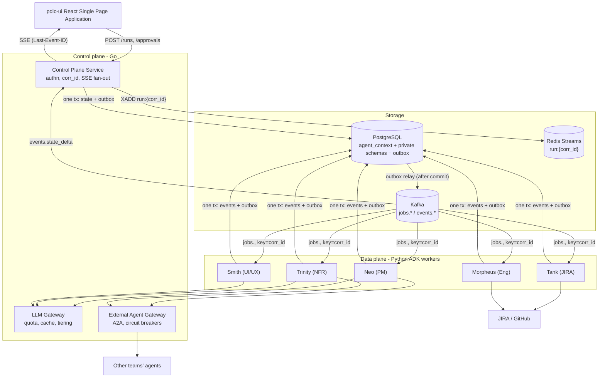
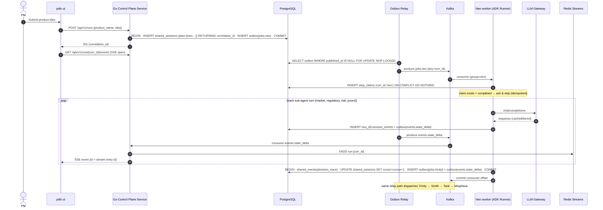
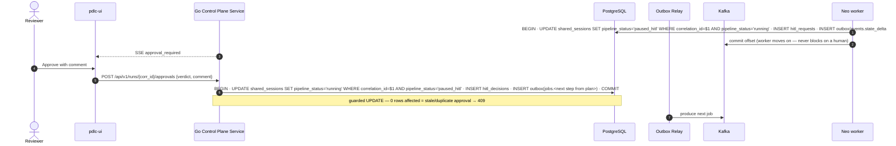
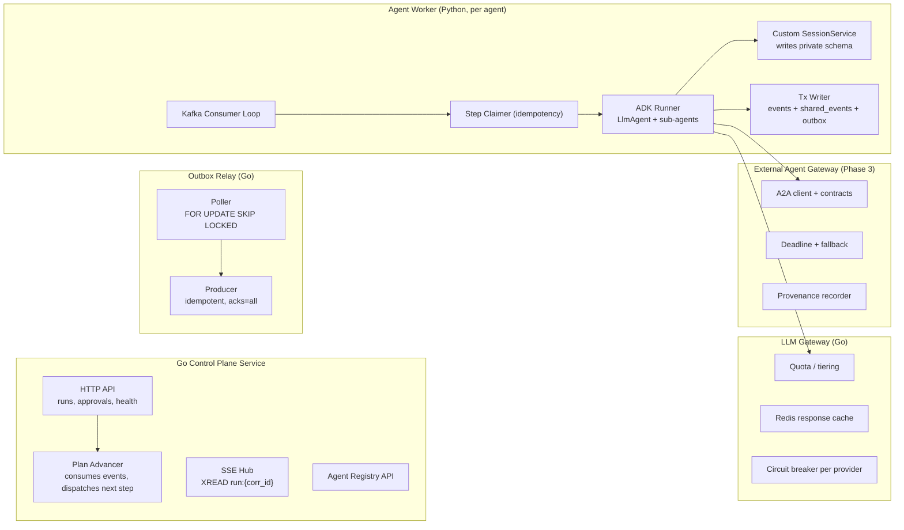
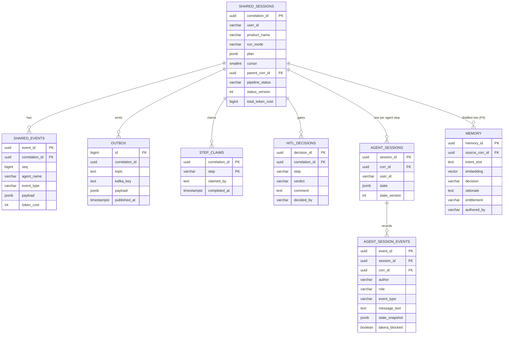
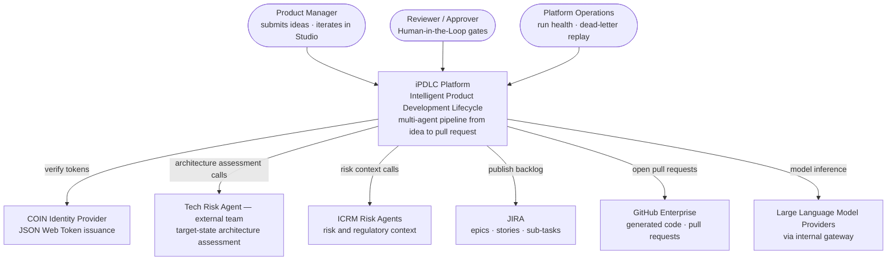
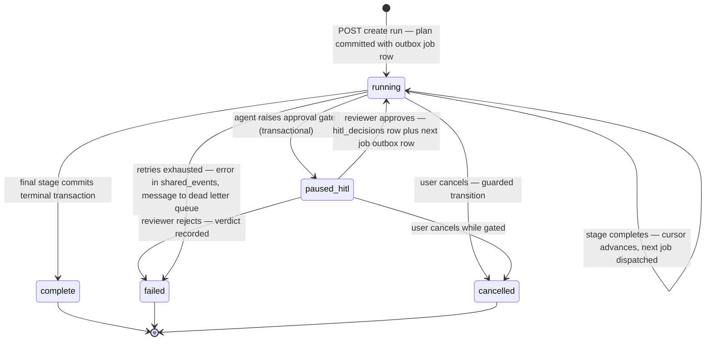
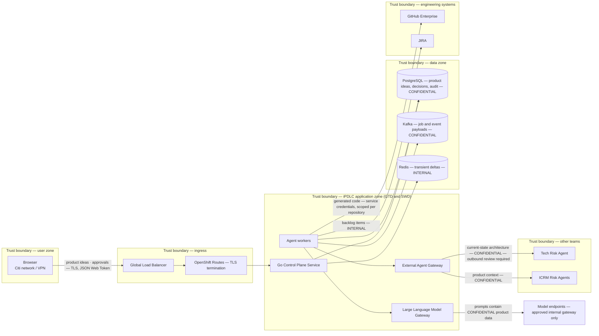
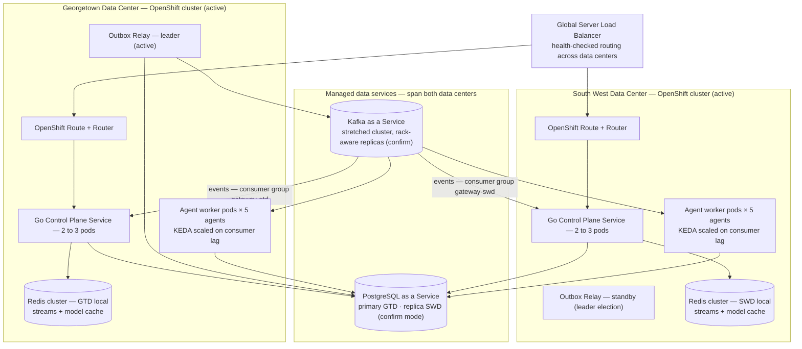

# iPDLC Platform Architecture — Phased Design

Target: enterprise platform, first milestone 5,000 users. Serial pipeline (Neo → Trinity → Smith → Tank → Morpheus) already working; this document defines how to harden and extend it.

Design principle throughout: **invariants first, features second, intelligence last.** The invariants are identity (corr_id), one write path (transactional outbox), one delivery path (SSE + Redis Streams), and auditability (everything reconstructable from Postgres).

---

## 1. Phasing

| Phase | Scope | Exit criteria |
|---|---|---|
| **1 — Reliability substrate** | Outbox + relay; `shared_sessions` as single state authority; plan-driven runs (linear only); agents → pure Kafka consumers (delete uvicorn + Celery); idempotent step claims; SSE + Redis Streams (delete WebSockets + pub/sub); OTel on corr_id; DLQs; agent health registry | Kill any pod mid-run → run completes. Disconnect browser 5 min → resumes with zero missed events. Any run fully reconstructable from Postgres alone. |
| **2 — Studio GA** | Single-step plans; multi-turn conversational sessions; health-aware UI; HITL as pure DB state; entitlement columns on all rows | PM runs any agent standalone; tabs grey out from registry before send; approval round-trip < 2s. |
| **3 — Cross-team integration** | External Agent Gateway (A2A calls, never topic subscriptions); contracts + schema validation; circuit breakers, degraded modes; response caching; provenance on every external result | External agent outage degrades a run (visible caveat in report) but never hangs it. |
| **4 — Institutional memory** | Post-run distiller; `agent_context.memory` + pgvector; retrieval-at-run-start via custom ADK MemoryService; juror calibration reports | Neo cites precedent in reports; memory rows carry human-decision provenance + entitlement scope. |

---

## 2. System diagram (mermaid)



Rules encoded in this picture:

1. Agents never publish to Kafka directly. Every message reaches Kafka through the outbox relay, after the Postgres transaction that produced it committed.
2. Agents never open HTTP ports. Jobs in via Kafka, results out via Postgres tx.
3. All cross-team traffic goes through the External Agent Gateway as request/reply calls with deadlines — never topic subscriptions.
4. The browser has exactly one inbound channel (SSE) and uses plain POSTs for actions.

---

## 3. Sequence diagram — full pipeline run (mermaid)



## 4. Sequence diagram — HITL pause and resume (mermaid)



Key rule: a HITL pause is a **database state**, not a blocked Kafka consumer. The worker acks and moves to other pipelines; resume is a new job message. This avoids `max.poll.interval.ms` violations and consumer-group rebalances during multi-hour approvals.

---

## 5. Component diagram (mermaid)



Component responsibilities, one line each:

- **HTTP API**: authn (COIN JWT), input validation, the two transactional writes (create run, record approval). Stateless.
- **SSE Hub**: per-connection goroutine doing `XREAD BLOCK` on `run:{corr_id}` from the client's `Last-Event-ID`. Stateless — any pod serves any client.
- **Plan Advancer**: consumes `events.state_delta` step-completions, reads `plan`/`cursor`, writes the next `outbox` job. The only component that knows the pipeline shape; agents never do.
- **Outbox Relay**: the sole Kafka producer for domain messages. Batch-polls unpublished rows, produces with `enable.idempotence=true`, marks `published_at`. Crash-safe: at-least-once into Kafka, deduped downstream by step claims.
- **Agent Worker**: no HTTP server. Consumer loop → claim step → run ADK Runner in-process → single commit transaction → ack offset. Scale = consumer group members, bounded by partition count.
- **Custom SessionService**: implements ADK's `BaseSessionService` against `<agent>_db.sessions` / `session_events` so ADK's own persistence *is* the audit trail (no double bookkeeping).

---

## 6. Database schema — full DDL

### 6.1 ERD (mermaid)



### 6.2 Shared schema

```sql
CREATE SCHEMA IF NOT EXISTS agent_context;

-- One row per run. THE single state authority.
CREATE TABLE agent_context.shared_sessions (
  correlation_id   UUID PRIMARY KEY DEFAULT gen_random_uuid(),  -- DB-generated, universal key
  user_id          VARCHAR(255) NOT NULL,                       -- SOEID
  product_name     VARCHAR(255) NOT NULL,
  run_mode         VARCHAR(20)  NOT NULL DEFAULT 'pipeline'
                   CHECK (run_mode IN ('pipeline','studio')),
  plan             JSONB        NOT NULL,   -- ["neo","trinity","smith","tank","morpheus"] or ["neo"]
  cursor           SMALLINT     NOT NULL DEFAULT 0,             -- index into plan
  parent_corr_id   UUID NULL REFERENCES agent_context.shared_sessions(correlation_id),  -- stage re-runs
  pipeline_status  VARCHAR(50)  NOT NULL DEFAULT 'running'
                   CHECK (pipeline_status IN ('running','paused_hitl','complete','failed','cancelled')),
  status_version   INTEGER      NOT NULL DEFAULT 0,             -- optimistic lock for transitions
  entitlement      VARCHAR(50)  NOT NULL DEFAULT 'default',     -- LOB / classification scope
  total_token_cost BIGINT       NOT NULL DEFAULT 0,             -- update ONLY via SET x = x + $1
  created_at       TIMESTAMPTZ  NOT NULL DEFAULT now(),
  last_update_time TIMESTAMPTZ  NOT NULL DEFAULT now()
);
CREATE INDEX idx_ss_user    ON agent_context.shared_sessions (user_id, created_at DESC);
CREATE INDEX idx_ss_active  ON agent_context.shared_sessions (pipeline_status)
  WHERE pipeline_status IN ('running','paused_hitl');

-- Cross-agent handoff + audit events. Append-only.
CREATE TABLE agent_context.shared_events (
  event_id       UUID PRIMARY KEY DEFAULT gen_random_uuid(),
  correlation_id UUID NOT NULL REFERENCES agent_context.shared_sessions(correlation_id),
  seq            BIGINT GENERATED ALWAYS AS IDENTITY,           -- total order for replay
  agent_name     VARCHAR(50)  NOT NULL,
  event_type     VARCHAR(50)  NOT NULL,   -- decision_trace|tool_result|status|hitl|external_result
  tool_name      VARCHAR(100),
  payload        JSONB        NOT NULL,   -- jira epic ids, pr_url, juror scores...
  provenance     JSONB,                   -- {source, team, retrieved_at} for external data
  token_cost     INTEGER      NOT NULL DEFAULT 0,
  created_at     TIMESTAMPTZ  NOT NULL DEFAULT now()
);
CREATE INDEX idx_se_corr ON agent_context.shared_events (correlation_id, seq);
CREATE INDEX idx_se_tool ON agent_context.shared_events (correlation_id, tool_name);

-- Transactional outbox. The ONLY door to Kafka.
CREATE TABLE agent_context.outbox (
  id             BIGINT GENERATED ALWAYS AS IDENTITY PRIMARY KEY,
  correlation_id UUID   NOT NULL,
  topic          TEXT   NOT NULL,        -- jobs.trinity, events.state_delta...
  kafka_key      TEXT   NOT NULL,        -- always correlation_id (ordering)
  payload        JSONB  NOT NULL,
  headers        JSONB  NOT NULL DEFAULT '{}',
  created_at     TIMESTAMPTZ NOT NULL DEFAULT now(),
  published_at   TIMESTAMPTZ NULL
);
CREATE INDEX idx_outbox_pending ON agent_context.outbox (id) WHERE published_at IS NULL;
-- Relay: SELECT * FROM agent_context.outbox WHERE published_at IS NULL
--        ORDER BY id LIMIT 500 FOR UPDATE SKIP LOCKED;

-- Idempotency guard for at-least-once Kafka delivery.
CREATE TABLE agent_context.step_claims (
  correlation_id UUID        NOT NULL,
  step           VARCHAR(50) NOT NULL,
  claimed_by     TEXT        NOT NULL,       -- pod name
  claimed_at     TIMESTAMPTZ NOT NULL DEFAULT now(),
  completed_at   TIMESTAMPTZ NULL,
  PRIMARY KEY (correlation_id, step)
);
-- Worker: INSERT ... ON CONFLICT DO NOTHING;
--   not inserted AND completed_at IS NOT NULL -> duplicate delivery, ack & skip
--   not inserted AND completed_at IS NULL AND claimed_at stale -> takeover (crashed peer)

CREATE TABLE agent_context.hitl_decisions (
  decision_id    UUID PRIMARY KEY DEFAULT gen_random_uuid(),
  correlation_id UUID NOT NULL REFERENCES agent_context.shared_sessions(correlation_id),
  step           VARCHAR(50)  NOT NULL,
  verdict        VARCHAR(20)  NOT NULL CHECK (verdict IN ('approved','rejected','changes_requested')),
  comment        TEXT,
  decided_by     VARCHAR(255) NOT NULL,      -- SOEID
  decided_at     TIMESTAMPTZ  NOT NULL DEFAULT now()
);
CREATE INDEX idx_hitl_corr ON agent_context.hitl_decisions (correlation_id);

-- Agent health / registry (Phase 1; drives Studio tab state)
CREATE TABLE agent_context.agent_registry (
  agent_name     VARCHAR(50) PRIMARY KEY,
  display_name   VARCHAR(100) NOT NULL,
  jobs_topic     TEXT NOT NULL,
  consumer_group TEXT NOT NULL,
  version        VARCHAR(50),
  heartbeat_at   TIMESTAMPTZ,
  status         VARCHAR(20) NOT NULL DEFAULT 'unknown'   -- healthy|degraded|down
);

-- Phase 4: institutional memory
CREATE EXTENSION IF NOT EXISTS vector;
CREATE TABLE agent_context.memory (
  memory_id      UUID PRIMARY KEY DEFAULT gen_random_uuid(),
  source_corr_id UUID NOT NULL REFERENCES agent_context.shared_sessions(correlation_id),
  intent_text    TEXT NOT NULL,
  embedding      VECTOR(768),
  decision       VARCHAR(50) NOT NULL,       -- approved|rejected|shipped|abandoned
  rationale      TEXT,                        -- from the HUMAN hitl comment
  domain_tags    TEXT[] NOT NULL DEFAULT '{}',
  entitlement    VARCHAR(50) NOT NULL,
  authored_by    VARCHAR(20) NOT NULL CHECK (authored_by IN ('human_verdict','llm_distilled')),
  created_at     TIMESTAMPTZ NOT NULL DEFAULT now()
);
CREATE INDEX idx_mem_vec ON agent_context.memory USING hnsw (embedding vector_cosine_ops);
CREATE INDEX idx_mem_ent ON agent_context.memory (entitlement);
```

### 6.3 Private agent schema (template — instantiate per agent: neo_db, trinity_db, smith_db, tank_db, morpheus_db)

```sql
CREATE SCHEMA IF NOT EXISTS neo_db;

CREATE TABLE neo_db.sessions (
  session_id       UUID PRIMARY KEY DEFAULT gen_random_uuid(),
  corr_id          UUID NOT NULL REFERENCES agent_context.shared_sessions(correlation_id),
  user_id          VARCHAR(255) NOT NULL,
  state            JSONB,
  state_version    INTEGER NOT NULL DEFAULT 1,   -- version the JSONB shape; migrations need this
  created_at       TIMESTAMPTZ NOT NULL DEFAULT now(),
  last_update_time TIMESTAMPTZ NOT NULL DEFAULT now()
);
CREATE INDEX idx_neo_sessions_corr ON neo_db.sessions (corr_id);
CREATE INDEX idx_neo_sessions_user ON neo_db.sessions (user_id);
-- Studio mode: many turns share ONE session (same session_id across job messages).
-- Pipeline mode: fresh session per stage.

CREATE TABLE neo_db.session_events (
  event_id       UUID PRIMARY KEY DEFAULT gen_random_uuid(),
  session_id     UUID NOT NULL REFERENCES neo_db.sessions(session_id) ON DELETE CASCADE,
  corr_id        UUID NOT NULL REFERENCES agent_context.shared_sessions(correlation_id),
  author         VARCHAR(255),    -- market_analyzer|regulatory_assessor|risk_assessor|juror_*|...
  role           VARCHAR(50),     -- user|model|system
  event_type     VARCHAR(50) NOT NULL,   -- message|state_delta|tool_call|tool_result|guardrail_block
  message_text   TEXT,
  state_snapshot JSONB,
  lakera_blocked BOOLEAN NOT NULL DEFAULT FALSE,
  token_cost     INTEGER NOT NULL DEFAULT 0,
  created_at     TIMESTAMPTZ NOT NULL DEFAULT now()
);
CREATE INDEX idx_neo_ev_session ON neo_db.session_events (session_id, created_at);
CREATE INDEX idx_neo_ev_corr    ON neo_db.session_events (corr_id);
CREATE INDEX idx_neo_ev_blocked ON neo_db.session_events (lakera_blocked) WHERE lakera_blocked;
```

This maps 1:1 to ADK's event model (author/role/event_type/state) — implement a custom `SessionService` so ADK persists here directly. Do not run `DatabaseSessionService` against its own tables and mirror into these; one write, one truth.

---

## 7. Kafka topic map

| Topic | Partitions | Key | Producer | Consumer group | Retention |
|---|---|---|---|---|---|
| `jobs.neo` | 12 | corr_id | outbox relay | `neo` | 7d |
| `jobs.trinity` | 12 | corr_id | outbox relay | `trinity` | 7d |
| `jobs.smith` | 12 | corr_id | outbox relay | `smith` | 7d |
| `jobs.tank` | 12 | corr_id | outbox relay | `tank` | 7d |
| `jobs.morpheus` | 12 | corr_id | outbox relay | `morpheus` | 7d |
| `events.state_delta` | 12 | corr_id | outbox relay | `go-gateway`, `plan-advancer` | 3d |
| `events.audit` | 12 | corr_id | outbox relay | archiver → object store | 30d |
| `jobs.<agent>.dlq` ×5 | 3 | corr_id | consumer error path | ops tooling | 30d |

Rules: producer is always the relay (`enable.idempotence=true`, `acks=all`); key is always corr_id so each pipeline is strictly ordered within its partition; consumers commit offsets only after their Postgres transaction commits; serialization is Avro or Protobuf behind a schema registry — raw JSON on cross-service topics is a Phase-1 fix, not a nice-to-have. The old fire-and-forget context WAL topic is retired: telemetry-grade writes may stay buffered, but nothing an agent reads ever takes that path.

---

## 8. Client delivery — SSE contract (WebSockets removed)

Direction decides the transport, not duration. All traffic here is server→client streaming plus rare client actions, so: SSE + POST. One channel to secure, monitor, and resume.

```
POST /api/v1/runs                          -> 201 {correlation_id}
POST /api/v1/runs/{corr_id}/messages       -> studio turn (studio mode only)
POST /api/v1/runs/{corr_id}/approvals      -> {verdict, comment}; guarded UPDATE; 409 if stale
GET  /api/v1/runs/{corr_id}/events         -> text/event-stream
GET  /api/v1/agents/health                 -> registry snapshot (drives Studio tab state)
```

SSE stream semantics:

- Event `id:` = the Redis Stream entry id. Browser `EventSource` auto-reconnects and sends `Last-Event-ID`; the Go pod does `XREAD run:{corr_id} FROM <last-id>` — replay of missed events is free.
- Event types: `step_started`, `state_delta`, `step_completed`, `approval_required`, `run_completed`, `run_failed`, `heartbeat` (every 15s to defeat idle proxies).
- Redis: `XADD run:{corr_id} MAXLEN ~ 1000`; `EXPIRE` 24h after terminal status. Redis is a delivery buffer, never the source of truth — a client reconnecting after expiry does `GET /runs/{corr_id}` and rehydrates from Postgres.
- Any Go pod serves any client (state lives in Redis/Postgres) — no sticky sessions, no special LB timeout config.

---

## 9. Agent worker anatomy (per agent)

```
process boundaries: 1 container = 1 consumer loop = 1 ADK Runner. No uvicorn. No Celery.

loop:
  msg     = consumer.poll()                      # group=<agent>; max.poll.interval sized to longest LLM step
  claim   = INSERT step_claims ON CONFLICT DO NOTHING
  if duplicate-and-completed: ack; continue
  session = session_service.get_or_create(corr_id)   # custom SessionService -> <agent>_db
  async for event in runner.run_async(session, msg.payload):
      persist(event)                             # session_events (+ outbox state_delta for UI-worthy events)
  BEGIN
      INSERT shared_events (handoff payload)
      UPDATE shared_sessions (cursor / status, guarded by status_version)
      UPDATE step_claims SET completed_at = now()
      INSERT outbox (events.state_delta step_completed)
  COMMIT
  consumer.commit()                              # offset AFTER the tx — at-least-once, deduped by claims
```

- Sub-agents (market analyzer, regulatory, risk, jurors) are ADK sub-agents / `AgentTool`s inside the Runner — in-process, not separate services.
- External calls (other teams' agents, Tech Risk) are ADK tools that call the External Agent Gateway with a hard deadline and a defined degraded result. A timeout produces a recorded caveat in the report — never a hung pipeline.
- Scaling: KEDA on consumer-group lag; max replicas = partition count (12).
- `plan` / `cursor` are invisible to the worker. It does its step and reports; the Plan Advancer routes.

---

## 10. Sizing at 5,000 users

Assumptions: 5k registered → ~250 peak concurrent UI sessions, ~30–60 concurrent active runs, each run ≈ 30–80 LLM calls over 5–20 minutes.

| Component | Sizing | Notes |
|---|---|---|
| Go Control Plane Service | 3 replicas, 0.5 vCPU / 512MB | 250 SSE conns is trivial for Go; 3 for HA |
| Outbox relay | 2 replicas | `SKIP LOCKED` lets them cooperate safely |
| Agent workers | 2 baseline pods per agent, KEDA → 12 | bound by jobs partitions |
| PostgreSQL | 4 vCPU / 16GB primary + 1 read replica | row volumes are tiny; replica serves dashboards/audit |
| Redis | 3-node cluster, ~2GB | streams + LLM cache; nothing durable lives here |
| Kafka | 3 brokers, RF=3 | 12 partitions/topic is comfortable headroom |
| LLM Gateway | 2 replicas | **the real bottleneck is provider rate limits** — quota queueing + model tiering matter more than any infra number on this page |

Honest note: at this scale nothing above is stressed. The design earns its keep on **failure behavior** (pod death, redelivery, reconnect, Postgres failover), not throughput. Load-test the failure modes, not just RPS.

---

## 11. Security & audit checklist (Phase 1 unless noted)

- COIN JWT at the edge; user SOEID propagated on every row.
- Kafka: per-consumer-group ACLs; mTLS between services; the relay is the only authorized producer on `jobs.*` / `events.*`.
- Schema registry with compatibility checks on all cross-service topics.
- Morpheus: GitHub App token scoped per-repo; branch protection so agent PRs can never merge without human review.
- Cross-team calls (Phase 3): service identity, contract validation, outbound data-classification review (Trinity sends current-state architecture outside the team — get that reviewed), provenance recorded in `shared_events`.
- Memory (Phase 4): entitlement filter at retrieval; retrieved content injected as delimited data, never instructions; only distill runs that carry a human decision.
- Audit: any run reconstructable from `shared_sessions` + `shared_events` + private `session_events`; `events.audit` archived to object store for retention.

---

## 11. Additional architecture views

### 11.1 System context (C4 Level 1)

The one-box view for architecture review boards: who and what surrounds the platform. No internals.



### 11.2 Run status state machine

The `runs.status` column, drawn. Every transition is a guarded UPDATE (`WHERE status = <from> AND version = $v`); anything not drawn here is forbidden and must fail the guard.



Operationally: `running` and `paused_hitl` are the only live states (the partial index in section 6.2 covers exactly these). A run stuck in `running` with a stale `last_update_time` and no consumer lag is the signature of a lost job — the ops runbook republishes from the outbox/audit trail with `attempt + 1`.

### 11.3 Data flow with trust boundaries

The security-review view: every place data crosses a boundary, with classification. Confirm classifications with Information Security — the flows marked confidential are the ones ICRM will ask about.



The three flows that need explicit sign-off: prompts to model endpoints (confidential product strategy leaving the app zone — the gateway's approved-endpoint allowlist is the control), the current-state architecture document sent to the Tech Risk team (outbound data review), and GitHub write access (scoped tokens, protected branches, mandatory human review on agent-generated pull requests).

### 11.4 Deployment — GTD and SWD data centers

Assumptions marked with (confirm): the exact active-active posture, PostgreSQL replica mode, and whether KaaS is stretched or mirrored are platform-team facts that should be verified and this diagram corrected.



Placement rules worth writing down: job consumer groups span both data centers (a partition is consumed in exactly one DC; DC loss rebalances to the survivor). The events topic is consumed by both DCs on purpose so each local Redis is complete (see the Redis Streams document). The outbox relay is single-active with leader election to preserve per-run publish ordering; the standby in the other DC takes over on lease expiry. PostgreSQL failover is the platform's runbook — until the primary is back or promoted, no *new* runs start, while SSE reads and in-flight consumption continue.
