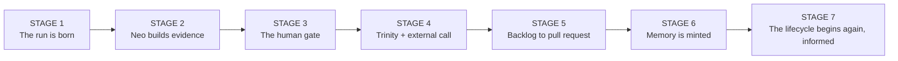
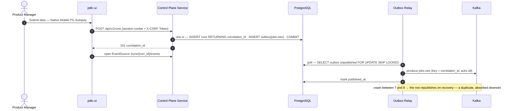
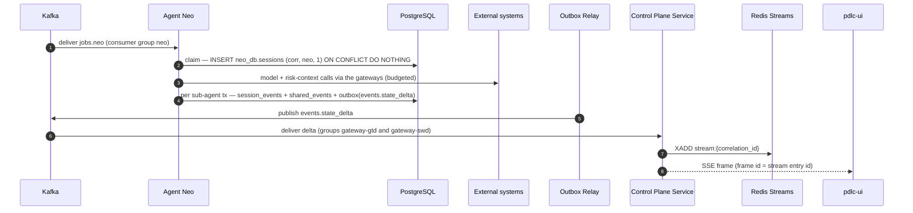
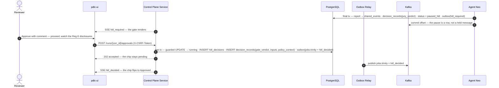
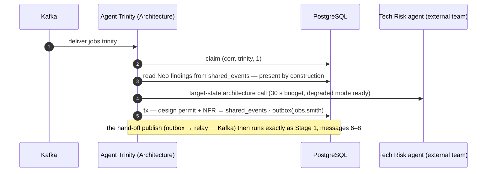
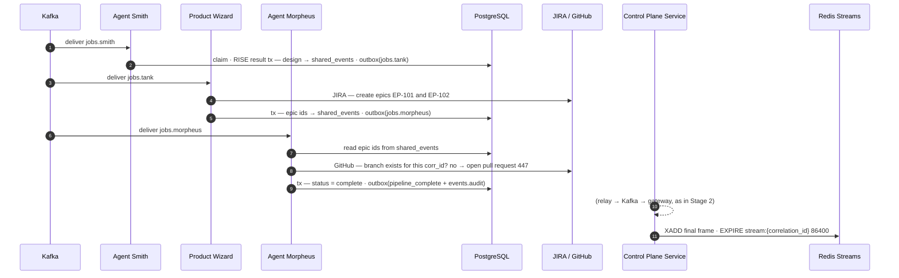
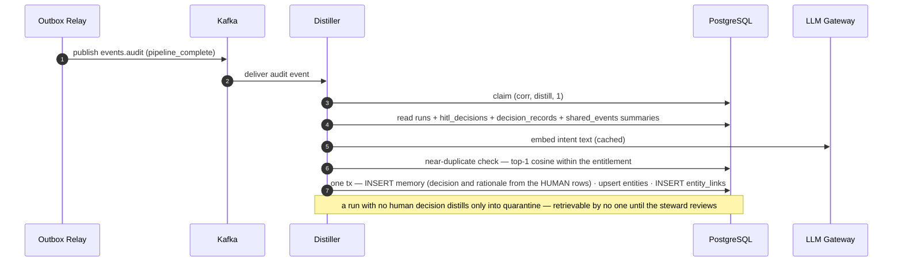
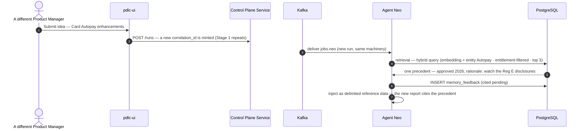

# iPDLC — The Complete Pipeline, End to End (The Run Lifecycle in Seven Stages)

Companion to the architecture set. The full life of a run — from a Product Manager's idea through every agent, the human gate, the decision layer, distillation into institutional memory, and the retrieval six months later — broken into seven lifecycle stages, each with its own small sequence diagram. Each stage shows only the participants it needs, numbers its own messages, and is explained step by step directly beneath it.

The run is the real one used throughout the set: **Native Mobile PIL Autopay**, correlation identifier `b0bcc68a…`.

## 0. Map of the lifecycle

One thread connects all seven: the correlation identifier minted in Stage 1 appears in every message, row, and stream entry through Stage 6 — and Stage 7 is a new run, with a new identifier, informed by this one.

---

## Stage 1 — the run is born

*Where the platform services sit in this stage — **Control Plane Service:** receives the POST, verifies identity and CSRF, runs the creation transaction. **Outbox Relay:** messages 6–8 are its whole job — publish after commit. **Redis Streams:** not yet involved; the run's stream begins at its first delta in Stage 2.*

**1.** The Product Manager submits the idea. Nothing exists yet — the interface creates no local state, because it is a projection of server state and the server hasn't spoken.

**2.** The POST carries the COIN session cookie (attached by the browser) and the `X-CSRF-Token` header — the proof this request came from our page, not a forged cross-site form. The Control Plane Service verifies the JSON Web Token locally against cached COIN keys: microseconds, no identity-provider round trip.

**3.** The most important transaction in the platform: the `runs` row (plan `["neo","trinity","smith","tank","morpheus"]`, cursor 0) and the first job's **outbox row** commit atomically, and PostgreSQL mints the correlation identifier via `RETURNING`. "The run exists" and "its first dispatch is recorded" are now one fact — they cannot diverge.

**4.** The client receives the correlation identifier — the key to everything that follows: the stream URL, the snapshot, the approval POST.

**5.** The browser opens its one `EventSource` for the run. From here on the interface never polls.

**6.** The Outbox Relay — single active leader — locks a batch of unpublished rows. It sees the row from step 3 *because* step 3 committed; there is no window where a message exists but its data doesn't.

**7.** The relay produces to Kafka keyed by the correlation identifier with `acks=all`. The key is what guarantees strict ordering *within* this run while thousands of runs spread across partitions.

**8.** Only after Kafka acknowledges does the relay mark the row published. The note names the crash window between 7 and 8 — the reason the whole platform is at-least-once and every consumer idempotent.

---

## Stage 2 — Neo builds the evidence

*Where the platform services sit in this stage — **Control Plane Service:** consumes every delta (one consumer group per data center) and serves the Server-Sent Events connection. **Outbox Relay:** publishes each state_delta after its commit (message 5 repeats per delta). **Redis Streams:** this is its core role — written by XADD (message 7), read by the blocked XREAD behind message 8.*

**1.** A Neo worker — one member of the `neo` consumer group, in whichever data center Kafka assigned the partition — receives the job. No HTTP anywhere: the agent is a Kafka consumer running the Agent Development Kit in-process.

**2.** The **claim**: an insert whose unique constraint on `(corr_id, step, attempt)` is the idempotency guard. A redelivered message hits the conflict, acknowledges, and walks away — duplicate work is impossible by construction.

**3.** Neo's sub-agents (Market Analyzer, Regulatory Assessor, Risk Assessor) think: model calls through the LLM Gateway (quota, cache, tiering), external context through the External Agent Gateway under hard timeouts, every result stored with provenance.

**4.** Each sub-agent completion is one small transaction — the event into Neo's private schema, the finding into `shared_events`, and an outbox row announcing progress. This cadence is what makes the interface feel alive during a minutes-long step.

**5–8.** The delta's journey to the screen: the relay publishes it; **both** data centers' gateway groups consume it (deliberate duplication so each local Redis is complete — whichever center holds the browser's connection has the stream); the gateway appends to `stream:{correlation_id}`; the Server-Sent Events frame carries the Redis entry identifier as its frame `id` — which is why a browser reconnect resumes *exactly*, using the protocol's own `Last-Event-ID`.

---

## Stage 3 — the human gate, where judgment becomes a record

*Where the platform services sit in this stage — **Control Plane Service:** the only writer of hitl_decisions and the gate's decision record; owns the guarded transition and the 202-then-confirm contract. **Outbox Relay:** publishes the next job and the confirmation after the gate commit (message 8). **Redis Streams:** carries the hitl_required and hitl_decided frames to the browser (messages 3 and 9 ride the Stage 2 path).*

**1.** Neo's final transaction is the decision layer's first appearance: the report commits to `shared_events`; the Judge-and-Jury outcome commits as a `decision_records` row of type `jury_verdict` (five juror scores, the judge's basis, the rubric version in force); the run flips to `paused_hitl`; and the gate announcement enters the outbox — all atomically.

**2.** Neo commits its offset and moves on. The pause lives in the database, not in an unacknowledged message — a gate can wait three days without holding a consumer hostage or triggering a rebalance.

**3.** The gate renders. The interface shows exactly what snapshot-plus-deltas say — nothing more.

**4.** The human decides. The comment is about to become the most valuable sentence this run produces.

**5.** The approval POST carries the CSRF token; the service additionally checks the caller holds the approver role *for this gate*, from the token claims.

**6.** The gate transaction — the heart of the context graph: a **guarded** update (`WHERE status='paused_hitl' AND version=$seen`; zero rows means another approver won, returned as a polite `409`), the `hitl_decisions` row, and the full `gate_verdict` **decision record** — the question, the pinned inputs (report hash, jury score, findings, the two precedents shown), and the policy context (skill v14, rubric v6, gate policy v2). Months later this decision replays exactly as the approver saw it. The next stage's job and the confirmation delta enter the outbox in the same commit.

**7.** The client gets `202` and shows a pending spinner. **Approvals are never optimistic** — the chip is an audit statement, not a click acknowledgment.

**8–9.** The relay publishes; the confirmation arrives over the same stream path as every other event; only now does the chip flip.

---

## Stage 4 — Agent Trinity (Architecture) and the external call

*Where the platform services sit in this stage — **Control Plane Service** and **Redis Streams:** progress deltas flow to the browser exactly as in Stage 2 (compressed out of the diagram). **Outbox Relay:** invisible here but essential — after message 5 commits, it publishes jobs.smith; the hand-off publish path is identical to Stage 1, messages 6–8.*

**1–2.** Trinity consumes and claims — identical machinery to Neo, because every agent is the same template.

**3.** Trinity reads Neo's findings from `shared_events`, and this read *cannot miss*: the outbox row that produced Trinity's job committed in the same transaction as (or after) the findings. This one guarantee is what the entire outbox design exists to buy.

**4.** The cross-team call goes through the External Agent Gateway with a 30-second budget. On timeout the pipeline does not hang: a `degraded_proceed` decision record is written under the timeout policy, the step carries a visible caveat, and work continues — degradation is a recorded decision, never a silent gap.

**5.** The design permit and Non-Functional Requirements commit to shared context and Smith is dispatched — one transaction, same pattern as every hand-off.

---

## Stage 5 — backlog to pull request

*Where the platform services sit in this stage — **Outbox Relay:** publishes every hand-off (jobs.tank, jobs.morpheus) and the terminal events after their commits. **Control Plane Service:** consumes the completion event, pushes the final frame, and sets the stream expiry (messages 10–11). **Redis Streams:** receives the final XADD, then EXPIRE 86400 — its job for this run is done.*

**1–2.** Smith claims, runs its accessibility-evaluated design loop, commits, and dispatches Tank.

**3–5.** Tank creates the JIRA epics — an **external side effect**, so it is guarded independently: a redelivered message first checks for existing epics for this correlation identifier. Then the epic identifiers commit to `shared_events` *before* Morpheus's job exists — pointer, not payload; the message says where to look, the database guarantees it's there.

**6–8.** Morpheus claims, reads the epic identifiers, and opens the pull request with the idempotency check performed **at GitHub itself** (does a branch for this correlation identifier already exist?) — because GitHub sits outside the PostgreSQL transaction and the claim guard alone cannot protect an external side effect.

**9.** The terminal transaction: status `complete`, plus outbox rows for the client-facing completion delta and the audit event that will wake the distiller.

**10–11.** The completion frame reaches the browser over the standard path (compressed here — it is exactly Stage 2, messages 5–8), the pull-request link renders, and the run's Redis stream gets a 24-hour expiry. Redis was only ever the last mile; the truth is already in PostgreSQL and Kafka.

---

## Stage 6 — the distiller mints institutional memory

*Where the platform services sit in this stage — **Outbox Relay:** message 1 — the audit event that wakes the distiller is an outbox row from Stage 5, published after commit. **Control Plane Service:** not involved; distillation is background work with no client. **Redis Streams:** not involved; nothing here is user-facing.*

**1–2.** The audit event publishes; the Distiller — just one more idempotent Kafka consumer — receives it.

**3.** The distiller claims with the same conflict guard as every agent: a redelivered audit event produces exactly one memory record, never two.

**4.** It reads the whole run — and note what it reads first: the human rows. The `hitl_decisions` and `decision_records` are the anchor; the event summaries are the surroundings.

**5.** The intent text embeds (768 dimensions) through the LLM Gateway, which caches it.

**6.** Near-duplicate check: an active memory above 0.95 cosine similarity within the same entitlement means this run *links to the existing precedent* rather than minting a competitor — one record per precedent, not one per run forever.

**7.** The memory transaction: `decision` and `rationale` are **copied from the human rows, never authored by the model**; entities upsert with alias resolution first ("Reg E" resolves to the existing Regulation E node); typed links land with `llm_extracted` confidence for the steward to confirm. The note states the cold rule: no human decision → quarantine only.

---

## Stage 7 — six months later, the lifecycle begins again, informed

*Where the platform services sit in this stage — **Control Plane Service:** mints the new run (Stage 1 machinery, new correlation identifier). **Outbox Relay:** publishes the new jobs.neo. **Redis Streams:** a fresh stream begins for the new run; the old run's expired stream is irrelevant — precedent lives in PostgreSQL, not Redis.*

**1–3.** A different Product Manager submits "Card Autopay enhancements" — worded nothing like PIL Autopay. A new correlation identifier is minted and Stages 1–2 repeat unchanged; message 3 picks up where the new run's Neo job arrives.

**4.** Before any thinking happens, retrieval runs: the intent embeds, entity candidates resolve by alias, and the **hybrid** query executes — vector distance *plus* an entity-hit bonus (the shared **Autopay** node), *plus* a human-authored bonus, entitlement-filtered **in SQL**, capped at three results so no single record can dominate the prompt.

**5.** The precedent returns: approved 2026, with the human's Regulation E warning — found through the entity spine even where pure text similarity would have missed it.

**6.** The retrieval immediately writes a `memory_feedback` row — the platform *measures* whether memory helps instead of believing it does; the `cited` flag resolves when the report ships.

**7.** The precedent enters Neo's prompt as a clearly delimited **reference-data block, never as instructions** (the structural half of the poisoning defense), and the new report opens with a "similar prior initiatives" section citing the 2026 decision and its condition. The institution remembered.

---

## The invariants these seven stages keep proving

Read together, five invariants recur, and they *are* the platform: **commit first, publish second** (1.3→1.7, 3.6→3.8, 5.9→6.1 — every announcement follows its data); **every consumer claims before it works** (2.2, 4.2, 5.2, 6.3 — duplicates are no-ops by construction); **pauses are rows, never held messages** (3.1–3.2); **judgment is data** (3.1, 3.6, 4.4 — jury verdicts, gate approvals, and even degraded-proceed policy calls all become decision records with pinned inputs and rule versions); and **memory is human-anchored and measured** (6.7, 7.4–7.6). Everything else in the architecture set is elaboration of these five.
