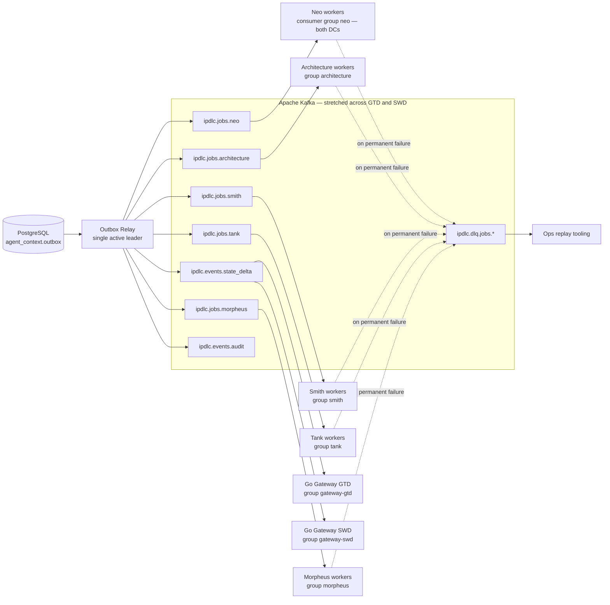

# iPDLC — Apache Kafka Flow (Detailed Design)

Companion to `ipdlc-architecture.md`. This document covers everything that touches Kafka: topics, producers, consumers, ordering, retries, dead letters, cross-data-center behavior, and one fully worked example of a pipeline run.

---

## 1. The two rules that everything else follows from

**Rule 1 — Only the Outbox Relay produces to Kafka.** Agents and the Go Control Plane Service never call a Kafka producer for pipeline messages. Every message begins life as a row in `agent_context.outbox`, written in the same PostgreSQL transaction as the state change it announces. The relay publishes it after commit. This is what makes it impossible for a downstream agent to receive "previous stage done" before that stage's data exists in the database.

**Rule 2 — Every consumer is idempotent.** The relay is at-least-once (it can crash between publishing and marking the row published). Kafka is at-least-once (rebalances redeliver). Therefore every consumer treats duplicates as no-ops via the claim guard: `INSERT INTO <agent>_db.sessions (corr_id, step_name, attempt) ... ON CONFLICT DO NOTHING` — zero rows inserted means another delivery already ran this step: acknowledge and skip.

---

## 2. Topic inventory

| Topic | Partitions | Key | Producers | Consumer groups | Retention |
|---|---|---|---|---|---|
| `ipdlc.jobs.neo` | 12 | correlation_id | outbox relay | `neo` | 7 days |
| `ipdlc.jobs.architecture` | 12 | correlation_id | outbox relay | `architecture` | 7 days |
| `ipdlc.jobs.smith` | 12 | correlation_id | outbox relay | `smith` | 7 days |
| `ipdlc.jobs.tank` | 12 | correlation_id | outbox relay | `tank` | 7 days |
| `ipdlc.jobs.morpheus` | 12 | correlation_id | outbox relay | `morpheus` | 7 days |
| `ipdlc.events.state_delta` | 12 | correlation_id | outbox relay | `gateway-gtd`, `gateway-swd` | 3 days |
| `ipdlc.events.audit` | 12 | correlation_id | outbox relay | compliance sink | 90+ days (or compacted) |
| `ipdlc.dlq.jobs.<agent>` (×5) | 3 | correlation_id | agent workers | ops tooling | 30 days |

Why these numbers: 12 partitions caps each agent at 12 concurrent workers, far above the 2–6 that KEDA will typically run at 5k users, leaving headroom without a repartition. Keying every message by `correlation_id` guarantees strict ordering *within a run* while runs scale horizontally across partitions. Note the events topic has **one consumer group per data center** — section 6 explains why.

Message schema versioning: every payload carries `"schema_version": 1`. JSON Schema validation at the consumer today; move to Avro + schema registry the day a second team consumes any topic.

---

## 3. Producer — the Outbox Relay

The relay is a small, boring, critical process. Loop:

```sql
BEGIN;
SELECT id, correlation_id, topic, msg_key, payload
FROM agent_context.outbox
WHERE published_at IS NULL
ORDER BY id
LIMIT 100
FOR UPDATE SKIP LOCKED;
-- produce each to Kafka, wait for acks
UPDATE agent_context.outbox SET published_at = NOW() WHERE id = ANY($ids);
COMMIT;
```

Producer configuration and the reason for each line:

```
acks = all                      -- a message is "published" only when in-sync replicas have it
enable.idempotence = true       -- broker de-duplicates producer retries
max.in.flight.requests = 5      -- safe WITH idempotence; ordering preserved
compression.type = zstd
linger.ms = 10                  -- tiny batching; latency budget is milliseconds vs LLM minutes
```

**Ordering caveat that will bite if ignored:** `FOR UPDATE SKIP LOCKED` with *multiple* relay replicas can publish two outbox rows for the *same* run out of order (replica A grabs row 100, replica B grabs row 101 and wins the race to the broker). Two acceptable designs: (a) a single active relay with leader election (simplest; throughput of one relay is thousands of messages/second — far beyond need), or (b) multiple relays that shard by `hash(correlation_id) % N` so one run's rows always flow through one relay. Start with (a).

Poll interval 100–250 ms. The added latency per hop is invisible against 20–60 second LLM steps.

---

## 4. Consumer — agent worker lifecycle

```
group.id = <agent name>
enable.auto.commit = false            -- offsets committed manually, AFTER the DB transaction
max.poll.records = 1                  -- one run step at a time per worker
max.poll.interval.ms = 1_800_000      -- 30 min: slowest LLM step plus margin
partition.assignment.strategy = CooperativeStickyAssignor   -- rebalances don't stop the world
```

Per-message sequence inside the worker:

1. Poll returns a job message.
2. **Claim:** insert the `(corr_id, step_name, attempt)` row. Conflict → duplicate delivery → commit offset, continue.
3. Run `runner.run_async()` (Google Agent Development Kit). Each ADK event is persisted to the private schema *plus* an outbox row for `events.state_delta` — one small transaction per event, so the UI streams progress.
4. Final transaction: `shared_events` result + `runs` cursor/status update + outbox rows (`events.state_delta` completion, `jobs.<next agent>` if the plan has a next step).
5. Commit the Kafka offset. **Offset commit is always last** — a crash before it means redelivery, which the claim absorbs.

**Human-in-the-loop never holds a message.** The gate is written to PostgreSQL (`status = 'paused_hitl'`), the offset is committed, the worker moves to other runs. Approval later inserts a fresh outbox job row. A three-day pause costs nothing and triggers no rebalance.

---

## 5. Retries and dead letters

Transient failure inside a step (LLM Gateway 5xx, DB timeout): the worker retries internally with exponential backoff (3 attempts). Still failing: it does one final transaction — mark the run `failed` with the error in `shared_events` — and produces the original message plus error metadata to `ipdlc.dlq.jobs.<agent>`. (The DLQ producer is the one exception to Rule 1, and it is acceptable because a DLQ message announces no state that another component reads transactionally.)

Poison messages (payload fails schema validation): straight to DLQ, no retries, alert.

Replay tooling: an ops command republishes a DLQ message to its origin topic with `attempt` incremented — the claim key includes `attempt`, so a replay runs cleanly without colliding with the failed attempt's rows.

---

## 6. Two data centers — GTD and SWD

Assumptions to confirm with the Kafka-as-a-Service platform team (marked because they change the design):

- **Assumed: KaaS is a stretched cluster** spanning GTD and SWD with rack-awareness (replicas placed across both DCs, `min.insync.replicas = 2`). If it is instead two clusters with MirrorMaker 2, offsets are not shared between DCs and consumer failover needs offset translation — a materially harder design. Confirm which one it is before Phase 1 completes.
- Job consumer groups (`neo` … `morpheus`) span both DCs: workers in GTD and SWD join the *same* group, so a partition is consumed in exactly one DC at a time and a DC loss just triggers a rebalance to the surviving DC.
- The events topic is the exception: `gateway-gtd` and `gateway-swd` are **separate consumer groups so both DCs consume every event**. Reason: a client's Server-Sent Events connection lives in exactly one DC, and that DC's local Redis must have the event. Duplicate consumption across DCs is intentional and harmless — each gateway writes only to its local Redis.

---

## 7. Topology diagram



---

## 8. Full worked example — one run, every Kafka message

Product: **Native Mobile PIL Autopay** (the run from the live system). Correlation ID: `b0bcc68a-eb58-44c6-a0de-86901489e835`. Plan: `["neo", "architecture", "smith", "tank", "morpheus"]`.

**Step 1 — Run created.** Gateway transaction inserts the run and one outbox row. Relay publishes:

```json
Topic: ipdlc.jobs.neo   Key: b0bcc68a-eb58-44c6-a0de-86901489e835   Partition: hash(key) % 12 = 7
Headers: { "schema_version": "1", "trace_id": "..." }
{
  "correlation_id": "b0bcc68a-eb58-44c6-a0de-86901489e835",
  "step_name": "neo",
  "attempt": 1,
  "run_mode": "pipeline",
  "user_id": "np12345",
  "input": { "product_name": "Native Mobile PIL Autopay",
             "idea": "Native mobile Autopay capability for PIL customers..." }
}
```

**Step 2 — Neo consumes.** A worker in the `neo` group (this happens to be a GTD pod; it could be SWD — irrelevant) claims `(b0bcc68a…, neo, 1)`. Claim succeeds. ADK Runner starts: Input Processor → Market Analyzer → Regulatory Assessor → Risk Assessor → Report Writer → Judge & Jury.

**Step 3 — Progress streams.** Each sub-agent completion writes a session event + outbox row. The relay publishes, for example:

```json
Topic: ipdlc.events.state_delta   Key: b0bcc68a-...
{ "correlation_id": "b0bcc68a-...", "agent": "neo",
  "event_type": "state_delta",
  "payload": { "sub_step": "regulatory_assessment", "status": "complete",
               "summary": "UDAAP, Dodd-Frank/CFPB, Reg E applicability identified" } }
```

Both `gateway-gtd` and `gateway-swd` consume it; each appends to its local Redis stream (see the Redis document).

**Step 4 — Human gate.** Judge & Jury passes; Neo's final transaction sets `status = 'paused_hitl'`, writes the report to `shared_events`, emits a `state_delta` with `"event_type": "hitl_required"`, and commits its Kafka offset. **No `jobs.architecture` message exists yet** — that is the point.

**Step 5 — Approval.** The reviewer clicks Approve (03:03 PM in the screenshot). Gateway transaction: guarded update `paused_hitl → running`, insert `hitl_decisions` row, insert outbox rows. Relay publishes `events.state_delta` (approval) and:

```json
Topic: ipdlc.jobs.architecture   Key: b0bcc68a-...
{ "correlation_id": "b0bcc68a-...", "step_name": "architecture", "attempt": 1,
  "context_pointer": "shared_events WHERE correlation_id = ... AND agent_name = 'neo'" }
```

Note the message carries a *pointer*, not the report itself — the report is already committed in `shared_events`, guaranteed readable because the outbox row that produced this message committed in the same or a later transaction.

**Step 6 — Redelivery drill (this WILL happen).** Suppose the Architecture worker finishes, commits its final transaction, and is OOM-killed before committing its Kafka offset. Kafka redelivers the job to another worker. That worker's claim insert hits the unique constraint on `(b0bcc68a…, architecture, 1)` → conflict → it commits the offset and walks away. No duplicate design permit, no duplicate downstream job (those outbox rows already committed exactly once).

**Steps 7–10.** Smith → Tank → Morpheus proceed identically. Tank's JIRA epic identifiers land in `shared_events`; Morpheus's job message points at them; Morpheus opens the pull request, guarded by an idempotency check against GitHub itself (does a branch/PR for this correlation_id already exist), because GitHub is outside the PostgreSQL transaction. Final transaction: `status = 'complete'`, terminal `state_delta`, audit event.

Total Kafka traffic for the run: 5 job messages, roughly 25–40 state deltas, a handful of audit events. At 200 concurrent runs this is trivially small — the design is chosen for *ordering and failure semantics*, not throughput.

---

## 9. Operations

Watch three numbers: **consumer lag per group** (KEDA's scaling input; alert on sustained growth), **outbox unpublished depth** (alert if it exceeds one poll budget — means the relay is down or Kafka is unreachable), and **DLQ arrivals** (every message is a run that failed permanently; page on it). Trace every produce and consume with the correlation_id as an OpenTelemetry attribute so one trace shows the whole run across both data centers.
