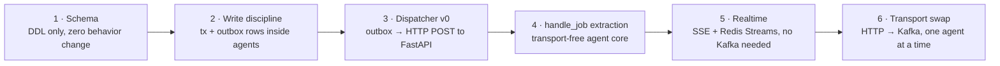

# iPDLC — Migration Plan: From FastAPI Agents to the Target Architecture

Current state: each agent is a uvicorn/FastAPI process invoked over HTTP; no Kafka; the pipeline works. This document is the ordered path from here to the target architecture — built around one insight: **the outbox pattern decouples correctness from transport.** An outbox row does not care whether it is delivered by a Kafka produce or an HTTP POST. So the correctness properties land first, against the agents exactly as they run today, and the transport swaps underneath later with no change to the guarantees.

---

## 1. The strangler sequence — six workstreams, in order



### Workstream 1 — land the schema (this week; zero behavior change)

One migration, nothing reads it yet: `agent_context.runs` (plan JSONB, cursor, status, version), `agent_context.outbox`, `agent_context.hitl_decisions`, `agent_context.decision_records`, the **unique claim constraint** `(corr_id, step_name, attempt)` on each agent's sessions table, and `agent_context.agent_registry`. Shipping DDL that nothing uses is the cheapest possible first step and unblocks everything else. Exit check: migration applied in all environments; existing pipeline unaffected.

### Workstream 2 — change the write discipline inside the existing agents

Still FastAPI, still uvicorn — but every **handoff-critical** write becomes synchronous and transactional, and every state change that announces something writes an **outbox row in the same transaction**: step results into `shared_events` + outbox(next job); gate raise = `status='paused_hitl'` + outbox(hitl_required); jury outcome = a `decision_records(jury_verdict)` insert. Fire-and-forget survives only for telemetry. The outbox rows accumulate unread for now — harmless. Exit check: kill the database connection mid-step in a test run → either the whole step's effects exist (result *and* dispatch row) or none do. The dual-write race is now dead, before any bus exists.

### Workstream 3 — the Dispatcher v0 (the relay, with an HTTP mouth)

Build the relay exactly as specified — poll unpublished rows `FOR UPDATE SKIP LOCKED`, single active leader, mark-published-after-delivery — but its publisher is **pluggable**, and v0's publisher is an HTTP client: row with topic `jobs.trinity` → `POST http://trinity:8000/jobs` with the payload; mark published on 2xx; retry with backoff otherwise. Simultaneously, **delete every direct agent-to-agent and gateway-to-agent call**: from now on, the *only* thing that invokes an agent is the dispatcher, and the only way to ask for an invocation is an outbox row. Exit check: grep the codebase — zero HTTP calls to agents outside the dispatcher; a run flows end to end through outbox rows alone.

This is the pivotal workstream: after it, you have the single write path, ordered dispatch, park-and-resume HITL (approval = guarded transition + outbox row; no consumer waits), and replayable dispatch history — **all of the target architecture's correctness, zero Kafka.**

### Workstream 4 — extract `handle_job` (make the agents transport-free)

Inside each FastAPI agent, refactor until the route handler is three lines:

```python
@app.post("/jobs")                      # today's transport
async def jobs(payload: JobPayload):
    asyncio.create_task(handle_job(payload))   # accept fast, work async
    return {"accepted": True}

async def handle_job(payload):          # the permanent core — transport-free
    if not await claim(payload): return          # idempotency guard (WS1 constraint)
    async for event in runner.run_async(...):    # the ADK tree, unchanged
        await persist_event_and_outbox_tx(event)
    await finalize_tx(payload)                   # shared_events · status · next-job outbox row
```

`handle_job` is the function the future Kafka consumer loop will call verbatim. Also in this workstream: delete Celery/Arq if present (the dispatcher replaced it), and add the registry heartbeat. Exit check: the FastAPI file for each agent is ~20 lines of shell around a core that imports nothing HTTP.

### Workstream 5 — realtime without waiting for Kafka

The Server-Sent Events migration does not need the bus either: the dispatcher (or a second small consumer of the outbox) applies `events.state_delta` rows by `XADD` to Redis Streams directly; the Go service serves the SSE contract (frame id = entry id, snapshot-first resync). Delete the WebSocket path when the flag flips. Exit check: browser refresh mid-run resumes with zero missed events — the Phase 1 drill, passed pre-Kafka.

### Workstream 6 — swap the transport, one agent at a time

Now — and only now — Kafka. The dispatcher gets a per-topic transport map: `jobs.neo → kafka`, everything else still `http`. Neo's deployment adds the consumer loop calling the same `handle_job`; soak it; flip the next agent. When all five are flipped: delete the FastAPI shells, delete uvicorn from the images, dispatcher drops its HTTP publisher and is now simply *the Outbox Relay*. Exit checks per agent: the redelivery drill (kill worker post-commit pre-ack → claim no-ops the duplicate) and lag-based KEDA scaling observed.

**Start in parallel on day one:** the KaaS onboarding request. At a bank, topic provisioning, quotas, and the stretch-vs-mirror answer have weeks of lead time — file it now so the platform is ready when Workstream 6 arrives, not the other way around.

---

## 2. If not Kafka — the honest alternatives

The load argument alone never justifies Kafka at this scale: 5,000 users produce low hundreds of messages per second at worst. So evaluate alternatives seriously:

| Option | What it is | Where it wins | Where it loses for iPDLC |
|---|---|---|---|
| **PostgreSQL as the queue** (SKIP LOCKED workers; pgmq / River / Graphile Worker, or hand-rolled) | Workers poll the outbox/jobs table directly — the dispatcher disappears; dequeue is transactional | Simplest possible ops (zero new systems); *transactional* dequeue; you effectively already built it in Workstream 3 | No replayable event log (audit stream, late consumers, DLQ-replay all become bespoke); event fan-out to both data centers' gateways needs LISTEN/NOTIFY or polling; queue load couples to the state database; the external team federates over Kafka regardless |
| **Redis Streams as the bus** | Consumer groups + acks on the store you already run | Already in the stack; consumer-group semantics are decent | Durability posture is wrong for the system of record of dispatches (even with AOF); retention is memory-bounded; weak cross-data-center story; you would be promoting the "never a source of truth" layer into one |
| **RabbitMQ / AMQP** | Classic broker with rich routing | Mature work-queue semantics, per-message acks | It is a queue, not a log: no replay, no long-retention audit stream; one more stateful system *you* run (no managed service in-house), for less than KaaS gives you |
| **NATS JetStream / Pulsar** | Modern log-ish systems | Technically capable | The deciding variable at a bank is platform support, and the platform team runs KaaS — an unsupported bus is an on-call liability, not an architecture choice |

**Recommendation, stated plainly:** the pragmatic path is *PostgreSQL-queue semantics now* (which Workstreams 1–5 give you as a side effect), *Kafka when KaaS provisioning lands* (Workstream 6). Kafka wins the end-state for four reasons that have nothing to do with throughput: **KaaS exists** — the operational burden is the platform team's, which beats every self-run alternative; the **external risk/regulatory federation** (Kafka doc §11) already needs the bridge to speak Kafka to the other team's bus; the **replayable, long-retention event log** is what the audit stream, DLQ-replay tooling, and the decision-trace thesis all lean on; and **partition-key ordering per correlation identifier** is native rather than reimplemented. If any of those four were false — no KaaS, no external Kafka partner, no audit-log requirement — the honest answer would be: stay on the PostgreSQL queue and never install Kafka at all. They are all true, so the plan is: correctness now on PostgreSQL, transport upgrade when the platform is ready, and the code shape (`handle_job`, outbox, claims) is identical either way — which is the entire point of doing the plumbing in this order.

### 2.1 Product shortlist (concrete options)

Evaluation lens: with the outbox as system of record, every dispatch is re-publishable from PostgreSQL — so the transport is judged on platform support, ordering, retention, and neighbor compatibility, not raw durability.

| Category | Products | Fit for iPDLC |
|---|---|---|
| Kafka-API compatible | **Redpanda** (single binary, no JVM/ZooKeeper, same clients + partition ordering) · Pulsar · WarpStream/AutoMQ (object-storage, cloud-centric — likely N/A on-prem) | Drop-in protocol fit; loses only on "who operates it" — a self-run stateful cluster is an on-call liability at a bank |
| Finserv incumbents — **check first** | **Solace PubSub+** (the de facto event bus in much of financial services) · **IBM MQ** · TIBCO EMS | If a platform team operates one with self-service provisioning, it may beat everything else for the jobs bus; weak as a replayable log — audit stays in PostgreSQL (it largely does anyway) |
| Lightweight self-run | **NATS JetStream** · **RabbitMQ** (+ its Streams feature) | Technically fine; same self-operation objection as Redpanda |
| PostgreSQL-native job queues | **Procrastinate** (Python/asyncio — matches the worker stack) · **River** (Go) · **pgmq** · Graphile Worker | Fastest path — Workstreams 1–5 build 80% of this anyway. Per-run ordering comes free from the pipeline's own structure: the next job's outbox row exists only after the previous step's commit |
| Durable-execution engines | **Temporal** | Replaces outbox + relay + state machine wholesale; a paradigm swap, not a transport swap — know it exists, do not adopt mid-migration |

**Pairings with Redis Streams:**

- **Pairing A (recommended interim):** PostgreSQL queue for jobs + Redis Streams for Server-Sent Events fan-out — the target design with the Kafka box swapped for the outbox; zero new products.
- **Pairing B:** Redis Streams for both jobs and fan-out — `XREADGROUP` consumer groups per agent, `XAUTOCLAIM` for dead-consumer recovery, a dead-letter stream; recoverable transport loss is acceptable because the outbox re-publishes. Known costs: consumer groups have **no per-key ordering across consumers** (mitigate by sharding streams by hash of the correlation identifier, one consumer per shard — hand-built partitions, acceptable if chosen knowingly); memory-bounded retention (the audit stream stays in PostgreSQL); and the external-team bridge speaks Kafka at their boundary regardless.

**The one question to ask the platform teams this week:** "which event/messaging service is blessed with self-service provisioning — KaaS, Solace, or MQ?" The dispatcher's transport map makes the answers interchangeable; the fastest-provisioned, least-governance-friction answer is probably the transport. If the answer is "nothing soon," Pairing A carries the platform indefinitely at this scale.

