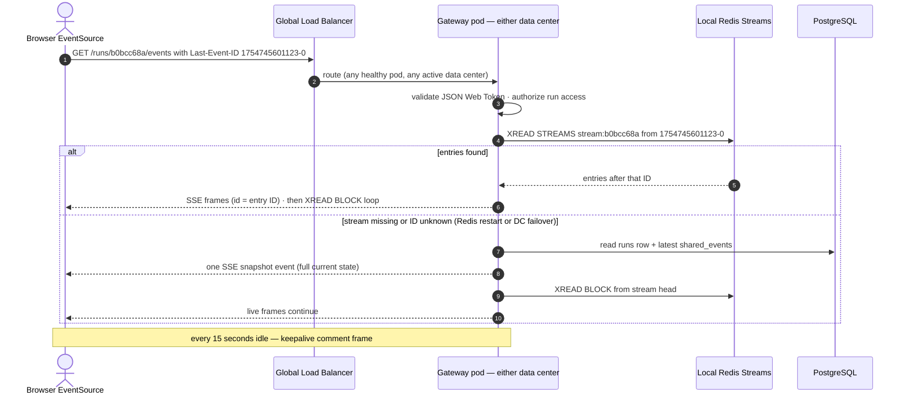

# iPDLC — Redis Streams for Server-Sent Events Fan-out (Detailed Design)

Companion to `ipdlc-architecture.md` and `ipdlc-kafka-flow.md`. This document covers the realtime delivery layer: how an agent's progress event, consumed from Kafka by any gateway pod in either data center, reaches the exact browser tab watching that run — including refreshes, reconnects, pod deaths, and a data-center failover.

---

## 1. Role and non-goals

Redis Streams is the **last-mile delivery buffer**, nothing more. Sources of truth are PostgreSQL (state) and Kafka (event log). If Redis lost every byte right now, no pipeline data would be lost — only in-flight UI deltas, and the recovery path in section 7 restores the client anyway. Design consequence: Redis here needs no persistence guarantees (AOF optional), only availability.

Redis also serves the Large Language Model Gateway's response cache — a separate keyspace (`llmcache:*`), separate concern, not covered here.

## 2. Why Streams and not Pub/Sub

The original design used Redis Pub/Sub keyed by correlation ID. Pub/Sub is fire-and-forget: a message published while the subscriber pod is restarting, or while the browser is reconnecting, is gone permanently. Streams fix all three gaps with one primitive:

1. **Delivery decoupled from presence** — `XADD` persists the entry whether or not anyone is reading.
2. **Replay** — a reader can start from any entry ID, not just "now".
3. **Resume** — the entry ID is monotonic and totally ordered, so "everything after the last ID I saw" is a single `XREAD` — which is exactly the contract of the browser's `Last-Event-ID` header.

## 3. Key design and lifecycle

```
Key:        stream:{correlation_id}          e.g. stream:b0bcc68a-eb58-44c6-a0de-86901489e835
Entry:      XADD stream:{corr_id} MAXLEN ~ 1000 * type <event_type> agent <name> payload <json>
Entry ID:   auto-generated, e.g. 1754745601123-0  (milliseconds-sequence — monotonic)
Trim:       MAXLEN ~ 1000 on every XADD (approximate trim — cheap)
Expiry:     EXPIRE stream:{corr_id} 86400 when the run reaches complete/failed/cancelled
```

One stream per run keeps reads perfectly scoped: an SSE handler reads exactly one key, and authorization is checked once at connection time against the run's owner/entitlement — never per event.

## 4. Write path (gateway event consumer)

Each gateway pod runs a Kafka consumer on `ipdlc.events.state_delta` (consumer group per data center — see section 6). Per message:

```
entry_id = XADD stream:{corr_id} MAXLEN ~ 1000 *
             type   <hitl_required | state_delta | pipeline_complete | ...>
             agent  <neo | architecture | ...>
             payload <json>
```

That is the entire write path. No routing table, no `SET ws:{corr_id} -> pod-N` registration, no lookup — the stream key *is* the routing. This deletes the fragile piece of the old design where an evicted routing key silently disconnected a user.

## 5. Read path (SSE handler) — the ID mapping that makes resume exact

```
GET /api/v1/runs/{corr_id}/events
Authorization: Bearer <JSON Web Token>
Last-Event-ID: 1754745601123-0        ← sent automatically by EventSource on reconnect
```

Handler logic on the gateway pod that holds the connection:

1. Validate the token; authorize the SOEID against the run's `user_id`/entitlement (once).
2. `start = Last-Event-ID header, else "0"` (from the beginning — the stream is trimmed, so "beginning" is at most ~1000 entries).
3. Loop: `XREAD BLOCK 15000 COUNT 100 STREAMS stream:{corr_id} <start>` — on entries, write SSE frames; on timeout, write a `: keepalive` comment (defeats idle middlebox timeouts); repeat from the last delivered ID.
4. Each SSE frame's `id:` field **is the Redis entry ID**:

```
id: 1754745601123-0
event: state_delta
data: {"agent":"neo","sub_step":"regulatory_assessment","status":"complete", ...}
```

Because the SSE `id` and the stream entry ID are the same value, the browser's automatic reconnect carries exactly the right cursor. Nobody writes resume logic; the protocol and the data structure snap together.

## 6. Multi-pod and multi-data-center correctness

The problem this layer solves: the pod that consumes a Kafka event is almost never the pod holding the browser's connection — and with GTD and SWD both active, it may not even be the same *data center*.

Topology decision: **Redis is per-data-center** (a local cluster in GTD, another in SWD; no cross-DC Redis replication). To make that correct, the events topic is consumed by **two consumer groups — `gateway-gtd` and `gateway-swd` — so every event is delivered in both data centers**, and each gateway writes only to its local Redis. Whichever DC the global load balancer pinned the client to, the local Redis has the full stream.

Why not one shared/replicated Redis: cross-DC Redis replication adds a consistency-and-latency problem to solve during failover, for zero benefit — the same events are already flowing through Kafka to both sides. Duplicate the cheap thing (consumption), not the hard thing (replicated state).

One constraint this creates: entry IDs are generated independently per DC, so a `Last-Event-ID` from a GTD stream is not guaranteed to exist verbatim in SWD's stream after a failover. IDs are millisecond timestamps, so the resume is still approximately correct — and the snapshot-first pattern in section 7 makes it exactly correct.

## 7. Failure modes and recovery

**Browser refresh / network blip (common):** `EventSource` reconnects with `Last-Event-ID`; handler resumes from that entry. Zero missed events, zero custom code.

**Gateway pod dies (routine):** the load balancer routes the reconnect to another pod in the same DC; same stream, same resume. Nothing else notices.

**Redis restarts and loses streams (rare):** the client's next `XREAD` finds an empty or missing stream. The gateway then serves the **snapshot-first pattern**: on any resume where the requested ID is not found, first send one synthetic `event: snapshot` built from PostgreSQL (`runs` row + latest `shared_events`), then continue live from the new stream head. The client re-renders from the snapshot and proceeds. This same pattern cleanly handles the cross-DC failover case from section 6 — recommend implementing snapshot-first from day one and treating ID-based resume as the optimization.

**Data-center failover (GTD lost):** the global load balancer moves clients to SWD; SWD's Redis already contains the streams because `gateway-swd` has been consuming all along; snapshot-first covers any ID mismatch. Recovery time is the load balancer's health-check interval, not a data rebuild.

## 8. Reconnect sequence diagram



## 9. Full worked example — same run as the Kafka document

Run `b0bcc68a-eb58-44c6-a0de-86901489e835`, Native Mobile PIL Autopay. Reviewer has the pipeline page open; their connection landed in GTD.

```
# Neo's regulatory sub-step completes → Kafka event → both gateways consume.
# GTD gateway pod 2 (not the pod holding the connection — irrelevant):
XADD stream:b0bcc68a-eb58-44c6-a0de-86901489e835 MAXLEN ~ 1000 *
     type state_delta agent neo
     payload '{"sub_step":"regulatory_assessment","status":"complete"}'
# → 1754745601123-0        (SWD gateway does the same into SWD Redis)

# GTD gateway pod 1 (holds the SSE connection), blocked in:
XREAD BLOCK 15000 COUNT 100 STREAMS stream:b0bcc68a-... 1754745598877-0
# → returns the new entry → writes frame:
#   id: 1754745601123-0
#   event: state_delta
#   data: {"agent":"neo","sub_step":"regulatory_assessment","status":"complete"}

# Judge & Jury passes, HITL gate raised:
XADD ... type hitl_required agent neo payload '{"gate":"neo_approval"}'
# → 1754745655412-0 → UI renders the Approve button

# Reviewer's laptop sleeps 20 minutes. EventSource auto-reconnects:
#   Last-Event-ID: 1754745655412-0
# Handler: XREAD STREAMS stream:b0bcc68a-... 1754745655412-0
# → returns everything since: the approval confirmation delta, Architecture
#   Agent progress deltas. Reviewer missed nothing; nobody wrote resume code.

# Pipeline completes (Morpheus pull request opened):
XADD ... type pipeline_complete agent morpheus payload '{"pull_request_url":"github.com/citi/.../pull/447"}'
EXPIRE stream:b0bcc68a-eb58-44c6-a0de-86901489e835 86400
```

## 10. Sizing at 5,000 users

Per active run: ≤1000 entries × ~1 KB ≈ 1 MB worst case, typically far less. At 200 concurrent runs: ~200 MB per data center — a small Redis. Connections: 500–1500 blocked `XREAD`s per DC, which Redis handles without configuration effort. The layer is deliberately boring; all the correctness lives in the ID mapping and the snapshot-first fallback.
