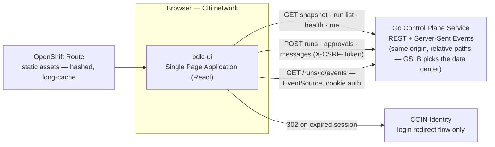
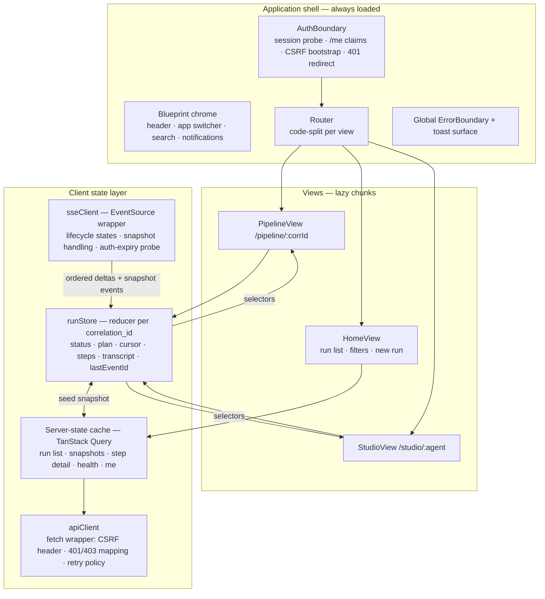
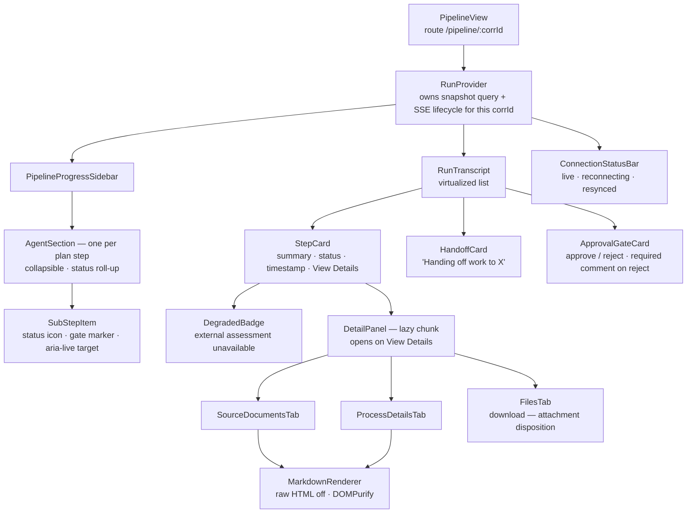
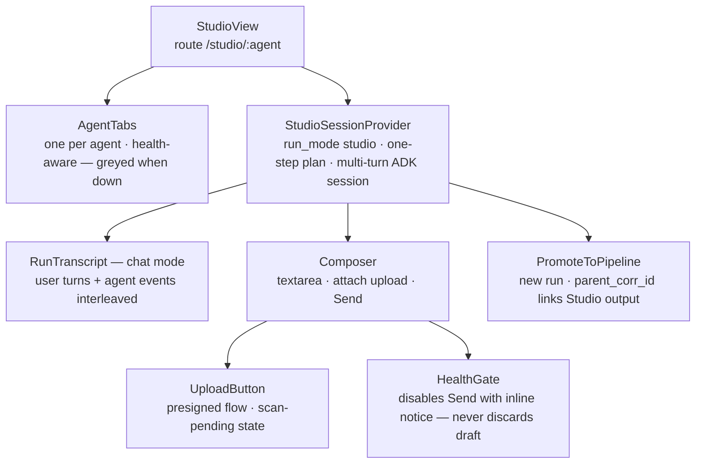
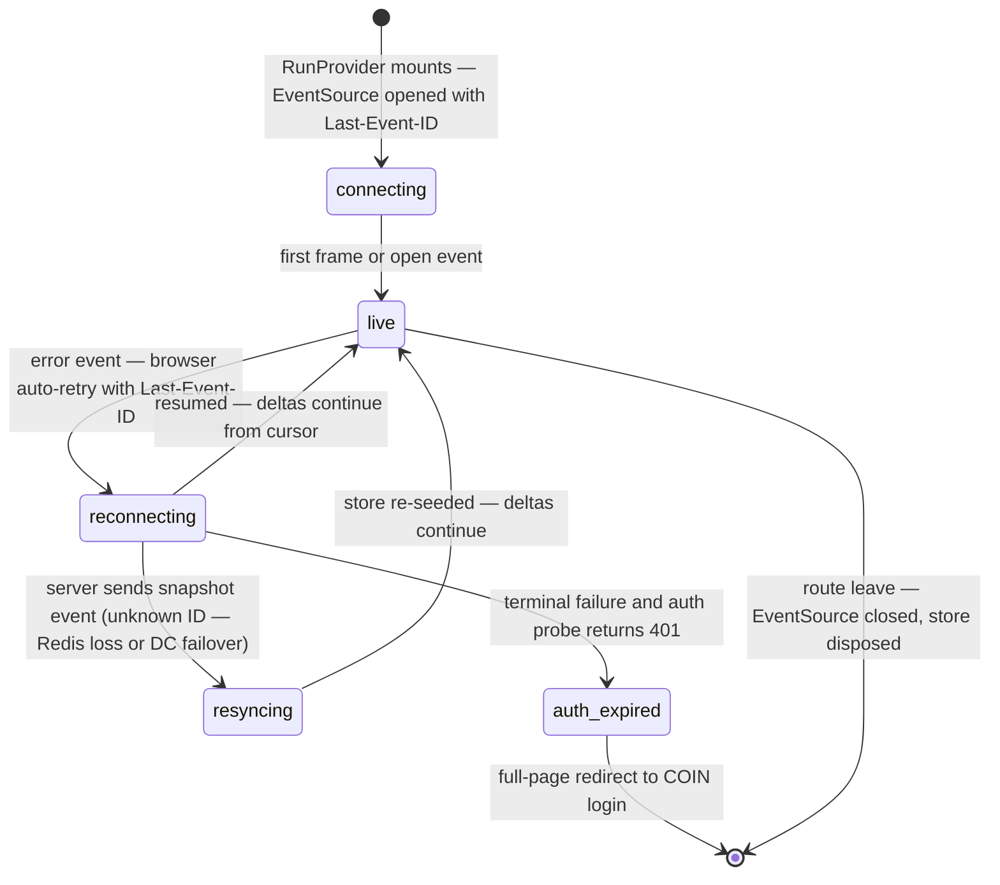
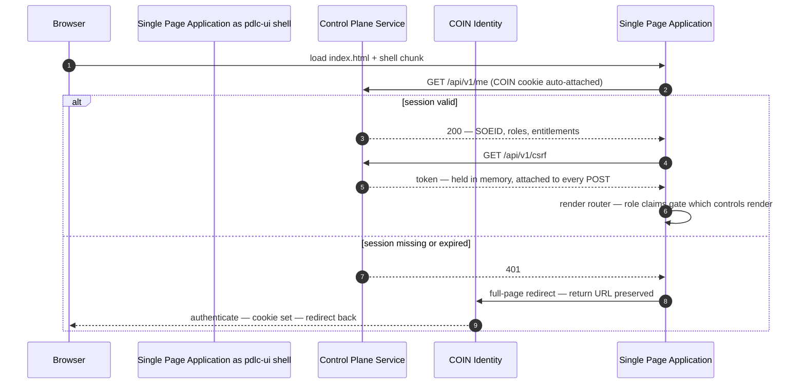
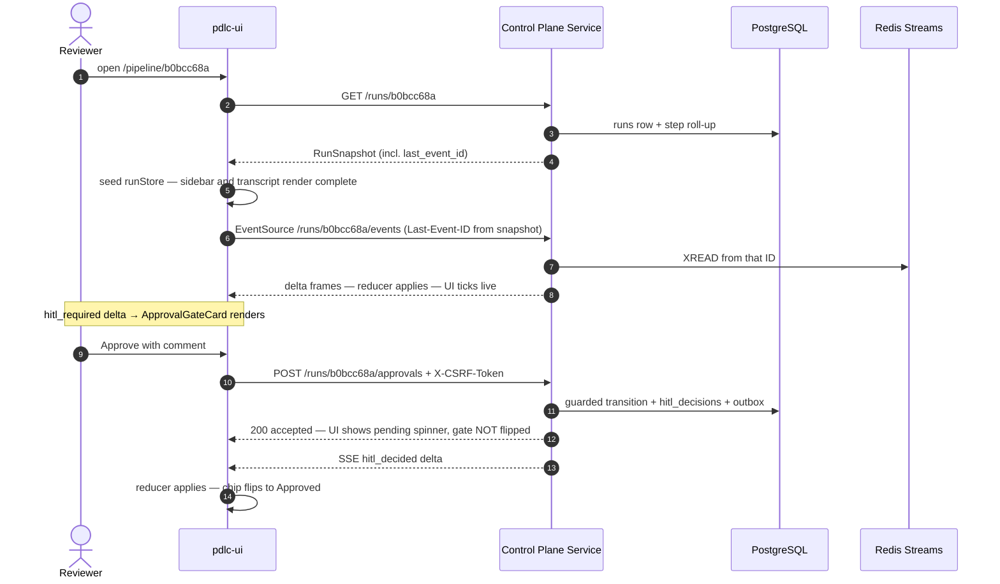
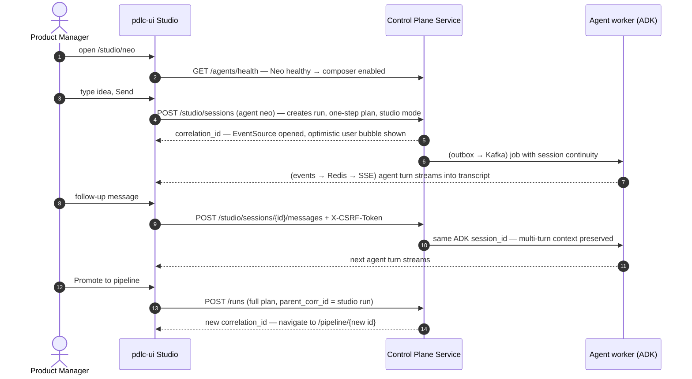

# iPDLC — User Interface Architecture (pdlc-ui)

Companion to `ipdlc-architecture.md`, `ipdlc-kafka-flow.md`, and `ipdlc-redis-streams-flow.md`. This is the complete frontend design: context, component architecture per view, the client state layer and its contracts, every critical sequence, security, testing, performance budgets, and the build order aligned with the backend phases.

---

## 1. Governing principle

**The UI is a projection of server state, never a source of truth.** Every rendered element derives from one snapshot plus ordered deltas. Nothing on screen exists that cannot be rebuilt from `GET /runs/{id}` + the Server-Sent Events stream. Consequence: refresh, laptop-sleep reconnect, Redis restart, second browser tab, and a GTD→SWD failover are all **one code path** — hydrate, then apply. Every design decision below either serves this principle or defends it.

---

## 2. UI system context

What the Single Page Application talks to — and the deliberately short list of things it is allowed to talk to (this list is also the Content Security Policy `connect-src`).



Rules encoded here: the Single Page Application calls exactly one API origin via relative paths (never a hardcoded data center — the Global Server Load Balancer decides); COIN is reached only by full-page redirect, never XHR; there are no third-party origins, which makes the CSP short and the security review shorter.

---

## 3. Application architecture (container level)



Why two state layers and not one global store: **TanStack Query** owns request/response data — caching, refetch, staleness are its whole job (run list, snapshots, lazy step detail, agent health, `/me`). The **runStore** owns exactly one thing per open run: the live projection built from snapshot + deltas. Components read via selectors; nothing writes to the store except the reducer. A single Redux-style store for everything smears server truth across ad-hoc caches — the split keeps each layer's invariant checkable.

---

## 4. Component-level architecture

### 4.1 PipelineView component tree



`RunProvider` is the only component with side effects: it fetches the snapshot, seeds the store, opens the EventSource, and tears both down on route leave. Everything below it is a pure function of store selectors — which is what makes the whole tree trivially testable and what enforces the governing principle structurally rather than by convention.

### 4.2 StudioView component tree



Studio and Pipeline share `RunTranscript`, the store, and the SSE client — a Studio session *is* a run with a one-step plan and a persistent ADK session, so the UI treats it as the same object in a different layout. `PromoteToPipeline` is the bridge the backend already supports via `parent_corr_id`: the PM iterates with Neo in Studio, then promotes the refined result into a full pipeline run without retyping anything.

### 4.3 Component inventory

| Component | Reads | Writes (via) | Notes |
|---|---|---|---|
| AuthBoundary | /me | — | Renders nothing until session + CSRF resolved |
| RunProvider | snapshot query, SSE | runStore (reducer only) | Sole side-effect owner per run |
| PipelineProgressSidebar | store selectors | — | Pure; mirrors plan + cursor + step statuses |
| RunTranscript | store selectors | — | Virtualized above 60 items |
| ApprovalGateCard | store, /me roles | POST /approvals | Never optimistic — flips on confirmed delta |
| Composer | health query, draft (local) | POST messages | Draft is the one legitimate client-only state |
| DetailPanel | step-detail query (lazy) | — | Content fetched on open, not in snapshot |
| MarkdownRenderer | props | — | The sanitization chokepoint — one implementation, used everywhere |
| ConnectionStatusBar | sseClient state | — | Driven by the section 6 state machine |
| AgentTabs / HealthGate | health query | — | 15 s stale time; disable before input, not after |

---

## 5. Client state contracts

The reducer and every component are typed against these. They mirror the backend's payloads — if the backend versions a schema, `schema_version` is where the UI branches.

```typescript
// What GET /api/v1/runs/{corrId} returns — the hydration seed.
interface RunSnapshot {
  schema_version: 1;
  correlation_id: string;
  run_mode: 'pipeline' | 'studio';
  plan: StepName[];                    // ["neo","trinity","smith","tank","morpheus"]
  cursor: number;
  status: 'running' | 'paused_hitl' | 'complete' | 'failed' | 'cancelled';
  steps: StepSummary[];                // roll-up per plan step incl. sub-steps
  pending_gate?: { gate: string; raised_by: StepName; raised_at: string };
  last_event_id: string;               // Redis entry ID — seeds the SSE cursor
  total_token_cost: number;
}

interface StepSummary {
  step: StepName;
  status: 'not_started' | 'running' | 'complete' | 'failed' | 'degraded';
  sub_steps: { name: string; status: string; summary?: string }[];
  degraded_reasons?: string[];         // e.g. "tech risk agent timeout — manual review"
}

// One SSE frame. The id field IS the Redis stream entry ID.
interface DeltaEvent {
  id: string;
  type: 'state_delta' | 'hitl_required' | 'hitl_decided'
      | 'pipeline_complete' | 'run_failed' | 'snapshot';
  agent?: StepName;
  payload: unknown;                    // narrowed per type by the reducer
}

// The reducer — the entire mutation surface of live run state.
function apply(state: RunState, e: DeltaEvent): RunState {
  if (e.type === 'snapshot') return seedFrom(e.payload as RunSnapshot); // wholesale replace
  if (compareStreamIds(e.id, state.lastEventId) <= 0) return state;     // duplicate → drop
  return { ...project(state, e), lastEventId: e.id };                   // ordered → apply
}
```

Invariants the reducer enforces (and tests assert): duplicates dropped by ID comparison; order trusted, never re-sorted (the backend paid for ordering with the Kafka partition key and the single Redis stream); `snapshot` replaces state wholesale — one code path for initial load, Redis loss, and data-center failover.

---

## 6. SSE connection state machine

Rendered by `ConnectionStatusBar`; owned by `sseClient`.



The `auth_expired` branch exists because `EventSource` cannot read a 401 response body — on terminal failure the wrapper probes one cheap authenticated endpoint; a 401 there means the COIN session died, and the only honest UX is the login redirect, not an infinite silent retry.

---

## 7. Critical sequences

### 7.1 Boot and auth bootstrap



### 7.2 Pipeline load, live updates, approval (the flagship flow)



The two-step ending is deliberate: **approvals are never optimistic.** The Approved chip is an audit statement — it renders only when the confirmed delta proves the row exists in `hitl_decisions`. One sub-second spinner in exchange for the UI never displaying an approval that lost the guarded-update race. (Studio message sends *may* render optimistic pending bubbles — a chat message is not an audit statement.)

### 7.3 Studio multi-turn session



---

## 8. Security obligations owned by the UI

**Agent output is untrusted input.** Every panel that renders LLM-generated content (regulatory assessments, reports, code summaries) goes through one `MarkdownRenderer`: markdown pipeline with raw HTML disabled → DOMPurify → render. Never `dangerouslySetInnerHTML` on raw agent text. Files download with `Content-Disposition: attachment`; previews render sandboxed. Rationale: a prompt-injected agent (poisoned upload, hostile external-agent response) makes the browser the place where the payload would finally execute — this renderer is the browser-side half of the platform's injection defense, which is why it is one shared implementation and not a per-panel choice.

**CSRF.** Token fetched once at boot, attached as `X-CSRF-Token` on every state-changing request (`/runs`, `/approvals`, `/messages`, cancel). GETs and the SSE stream carry none. Verify the COIN cookie's `SameSite` attribute rather than assuming it — it is issued outside this codebase.

**Content Security Policy.** No inline scripts, `default-src 'self'`, `connect-src` = the API origin only (the section 2 diagram is the allowlist). Backstops any sanitization miss; cheap because the header pipeline already exists at Citi.

**Role-aware rendering is UX, not security.** Approve renders only for approver roles (from `/me` claims) — and the Control Plane Service enforces the role on POST regardless. Hiding the control is courtesy; the server rejecting it is the control.

---

## 9. Error, loading, and degraded states (the matrix)

| Condition | Where | Rendering rule |
|---|---|---|
| Snapshot loading | any run view | skeleton sidebar + transcript — never a spinner-only page |
| Run not found / 403 | run views | distinct screens — "no access" is not "does not exist" |
| Agent down | Studio | tab greyed + notice before input — draft never discarded if it flips mid-typing |
| Step degraded | transcript | DegradedBadge from shared_events caveat — never rendered identical to complete |
| Run failed | run views | terminal banner + failed step highlighted + error summary from shared_events |
| SSE reconnecting | status bar | visible "reconnecting" — user must be able to tell stalled from disconnected |
| Resynced via snapshot | status bar | brief "resynced" confirmation — then back to live |
| Session expired | anywhere | COIN redirect with return URL — no dead-end 401 screens |
| Empty run list | Home | first-run guidance with New Run action, not a blank table |

---

## 10. Performance budgets and rendering discipline

Shell chunk (auth + chrome + router) under **200 KB gzipped**; each view chunk under **150 KB**; markdown renderer + DOMPurify load with the transcript chunk, never the shell. Transcript virtualizes above ~60 items (a multi-day Studio session must not degrade). Step detail is lazy — the snapshot carries summaries, `DetailPanel` fetches full content on open. Store selectors are memoized per step so a delta for Neo does not re-render Smith's section. One EventSource per open run, torn down on route leave — and **confirm the OpenShift route serves HTTP/2**: `EventSource` on HTTP/1.1 is capped at six connections per origin, and a reviewer with several tabs will starve without multiplexing.

---

## 11. Testing strategy

**Reducer tests (highest value per line):** property-style assertions on the section 5 invariants — duplicate delivery is a no-op, out-of-order IDs never regress state, `snapshot` replaces wholesale, every delta type projects correctly. These run in milliseconds and guard the exact contract the backend relies on.

**Component tests** with a mocked store: gate renders on `hitl_required`, flips only on `hitl_decided`; DegradedBadge appears from caveats; role-gated controls respect `/me` claims.

**API + SSE integration:** MSW for REST; an `EventSource` mock (or polyfill against a test stream) to script delivery, duplication, disconnection, and snapshot-resync — the reconnect drill from the Redis document, executed in CI.

**End-to-end (Playwright):** the three journeys that must never break — submit idea → watch pipeline → approve gate → see confirmed chip; kill the stream mid-run → observe reconnecting → resynced → live; Studio multi-turn → promote to pipeline. Plus axe-core accessibility assertions on every view.

**Sanitization regression:** a fixture file of hostile markdown (script tags, event handlers, data URIs, embedded HTML) rendered through `MarkdownRenderer` asserting inert output — this is the test security review will ask to see.

---

## 12. Accessibility

The platform that enforces WCAG 2.1 AA on generated designs (Smith's evaluation loop) is held to WCAG 2.1 AA itself. Concretely: the approval flow completable by keyboard alone; `aria-live="polite"` on step-status changes so screen readers hear pipeline progress; focus management when DetailPanel opens and closes; Blueprint tokens for contrast; status conveyed by icon + text, never color alone (the degraded/complete distinction especially).

---

## 13. Build, delivery, and structure

**Toolchain:** Vite — maintained mainstream default for React Single Page Applications, near-zero config for the requirements above (route-level code splitting, CSP-clean production output with no eval, hashed long-cache filenames, dev proxy that handles SSE correctly). **Subject to any mandated Citi frontend toolchain, which takes precedence** — if a blessed preset exists for the LOB, conform and port these requirements into it.

**Delivery:** static assets from the OpenShift route, hashed filenames with immutable cache, Single Page Application fallback to `index.html`; API reached via relative paths so the Single Page Application is identical in GTD and SWD — the GSLB decides, the bundle never knows.

**Source layout** (feature-sliced, matching the component architecture):

```
src/
  app/            shell, router, providers, AuthBoundary, ErrorBoundary
  views/
    home/         RunList, filters, NewRunModal
    pipeline/     PipelineView, sidebar, DetailPanel tabs
    studio/       StudioView, AgentTabs, Composer, PromoteToPipeline
  entities/run/   runStore, reducer, selectors, types (section 5 contracts)
  shared/
    api/          apiClient (CSRF, 401 mapping), query hooks
    sse/          sseClient wrapper + connection state machine
    markdown/     MarkdownRenderer (the sanitization chokepoint)
    ui/           Blueprint wrappers, StatusIcon, badges
```

---

## 14. UI build order (aligned with backend phases)

| Backend phase | UI work |
|---|---|
| 1 — single write path | Migrate WebSocket → SSE client + snapshot hydration + reducer; CSRF plumbing; MarkdownRenderer sanitization; ConnectionStatusBar. Exit: refresh mid-run resumes with zero missed events; hostile-markdown fixture renders inert. |
| 2 — studio + surface | StudioView, AgentTabs with health gating, multi-turn composer, PromoteToPipeline; role-gated controls from /me. Exit: dead agent is grey before input; 5-turn session promotes to pipeline. |
| 3 — cross-team | DegradedBadge + caveat rendering from shared_events. Exit: killed external agent shows visibly degraded step, not a fake-complete one. |
| 4 — memory | "Similar prior initiatives" panel on Neo's report (retrieved precedent with provenance links to source runs). |

---

## 15. UI-owned invariants (the checklist)

1. Rebuildable from snapshot + deltas at any moment; the composer draft is the only legitimate client-only state.
2. Deltas applied by ID: drop duplicates, trust order, never re-sort.
3. Approvals render only on confirmed delta — never optimistically.
4. All agent-generated content passes through the one MarkdownRenderer; strict CSP behind it.
5. State-changing requests carry the CSRF token; GETs and the SSE stream do not.
6. Dead agents are visible before input; drafts survive health flips.
7. Degraded steps are visually distinct from complete steps — icon + text, not color alone.
8. 401 anywhere routes to COIN with a return URL — no dead ends, no silent retry loops.
